# Laporan Praktikum Tugas Modul 1 sampai 10
## Implementasi Jaringan Enterprise HQ-Branch dengan VRRP, ISC-DHCP, FortiGate, GRE Tunnel, dan OSPF

---

## Identitas Kelompok

| Nama                          | NRP        |
| ----------------------------- | ---------- |
| Devi Putri Sekar Arum         | 5024241049 |
| Rahmat Maulana Anssori         | 5024241011 |

---

## Daftar Isi

1. [Pendahuluan](#1-pendahuluan)
   - 1.1 [Latar Belakang](#11-latar-belakang)
   - 1.2 [Tujuan Praktikum](#12-tujuan-praktikum)
   - 1.3 [Topologi Jaringan](#13-topologi-jaringan)
   - 1.4 [Tabel Pengalamatan IP](#14-tabel-pengalamatan-ip)
2. [Tugas Modul 1: Konfigurasi Cisco Switch Jakarta](#2-tugas-modul-1-konfigurasi-cisco-switch-jakarta)
3. [Tugas Modul 2: Konfigurasi Cisco Router Jakarta](#3-tugas-modul-2-konfigurasi-cisco-router-jakarta)
4. [Tugas Modul 3: Konfigurasi MikroTik Router Jakarta](#4-tugas-modul-3-konfigurasi-mikrotik-router-jakarta)
5. [Tugas Modul 4: Konfigurasi Ubuntu Server Jakarta](#5-tugas-modul-4-konfigurasi-ubuntu-server-jakarta)
6. [Tugas Modul 5: Konfigurasi FortiGate Jakarta](#6-tugas-modul-5-konfigurasi-fortigate-jakarta)
7. [Tugas Modul 6: Konfigurasi MikroTik ISP](#7-tugas-modul-6-konfigurasi-mikrotik-isp)
8. [Tugas Modul 7: Konfigurasi Switch dan MikroTik Surabaya](#8-tugas-modul-7-konfigurasi-switch-dan-mikrotik-surabaya)
9. [Tugas Modul 8: Konfigurasi FortiGate Surabaya](#9-tugas-modul-8-konfigurasi-fortigate-surabaya)
10. [Tugas Modul 9: Konfigurasi GRE Tunnel dan OSPF over GRE](#10-tugas-modul-9-konfigurasi-gre-tunnel-dan-ospf-over-gre)
11. [Tugas Modul 10: Pengujian Akhir Sistem](#11-tugas-modul-10-pengujian-akhir-sistem)
12. [Kesimpulan Umum](#12-kesimpulan-umum)

---

## 1. Pendahuluan

### 1.1 Latar Belakang

Praktikum ini membahas implementasi jaringan enterprise yang menghubungkan dua lokasi, yaitu kantor pusat (Headquarters atau HQ) di Jakarta dan kantor cabang (Branch) di Surabaya. Kedua lokasi dihubungkan menggunakan teknologi GRE Tunnel sehingga komunikasi data dapat berjalan meskipun kedua lokasi berada pada jaringan fisik yang berbeda. Topologi jaringan ini menggunakan kombinasi perangkat virtual, yaitu Cisco IOS (router dan switch), MikroTik RouterOS, FortiGate, Ubuntu Server, Tinycore Linux, dan VPCS.

Konfigurasi pada sisi Jakarta menerapkan mekanisme dual gateway menggunakan VRRP (Virtual Router Redundancy Protocol) antara Cisco Router dan MikroTik Router, serta DHCP terpusat menggunakan ISC-DHCP Server yang berjalan pada Ubuntu Server. Pada sisi Surabaya, MikroTik Router berperan sebagai gateway tunggal dengan DHCP Server lokal. FortiGate pada kedua lokasi berfungsi sebagai firewall, NAT gateway, sekaligus endpoint GRE Tunnel. OSPF dijalankan di atas GRE Tunnel agar rute antar-site dapat saling dipertukarkan secara dinamis.

### 1.2 Tujuan Praktikum

Setelah menyelesaikan seluruh tugas modul, praktikan diharapkan mampu:

1. Mengonfigurasi VLAN dan trunk pada Cisco Switch.
2. Mengonfigurasi VRRP antara Cisco Router dan MikroTik Router.
3. Mengonfigurasi DHCP Server terpusat menggunakan Ubuntu Server dan ISC-DHCP.
4. Mengonfigurasi DHCP Relay pada router.
5. Mengonfigurasi FortiGate sebagai firewall dan NAT gateway.
6. Mengonfigurasi MikroTik sebagai simulasi jaringan penyedia layanan internet (ISP).
7. Mengonfigurasi jaringan cabang Surabaya menggunakan FortiGate dan MikroTik.
8. Mengonfigurasi GRE Tunnel antar-FortiGate.
9. Mengonfigurasi OSPF over GRE dengan redistribute static route.
10. Menguji konektivitas antar-site menggunakan ping dan akses web server.

### 1.3 Topologi Jaringan

Berikut adalah topologi jaringan yang digunakan pada seluruh rangkaian tugas modul.

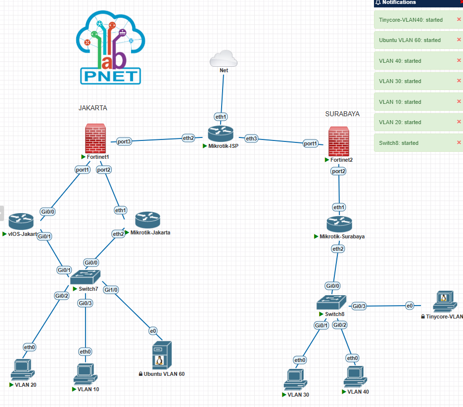

Topologi terdiri atas tiga bagian utama, yaitu sisi HQ Jakarta, sisi penyedia layanan internet atau ISP, dan sisi Branch Surabaya.

**Sisi HQ Jakarta** terdiri atas Cisco Switch Jakarta, Cisco Router Jakarta, MikroTik Router Jakarta, Ubuntu Server Jakarta, FortiGate Jakarta, serta klien pada VLAN 10 dan VLAN 20. Cisco Router Jakarta dan MikroTik Router Jakarta berfungsi sebagai dual gateway menggunakan VRRP. Ubuntu Server Jakarta berfungsi sebagai DHCP Server terpusat untuk VLAN 10 dan VLAN 20. FortiGate Jakarta berfungsi sebagai firewall tepi jaringan, NAT gateway, dan endpoint GRE menuju Surabaya.

**Sisi ISP** disimulasikan menggunakan MikroTik RouterOS yang menghubungkan FortiGate Jakarta dan FortiGate Surabaya. MikroTik ISP juga dikonfigurasi NAT menuju Cloud PNETLab agar perangkat internal dapat mengakses internet.

**Sisi Branch Surabaya** terdiri atas FortiGate Surabaya, MikroTik Router Surabaya, Cisco Switch Surabaya, serta klien pada VLAN 30 dan VLAN 40. FortiGate Surabaya berfungsi sebagai firewall tepi jaringan dan endpoint GRE. MikroTik Surabaya berfungsi sebagai gateway VLAN 30 dan VLAN 40. VLAN 30 menggunakan DHCP Server dari MikroTik, sedangkan VLAN 40 menggunakan IP statis.

### 1.4 Tabel Pengalamatan IP

#### 1.4.1 VLAN Jakarta

| VLAN | Nama VLAN | Network          | Gateway Virtual | Keterangan                       |
| ---: | --------- | ----------------- | ---------------- | --------------------------------- |
| 10   | FINANCE   | 192.168.10.0/24   | 192.168.10.1     | DHCP dari Ubuntu Server Jakarta   |
| 20   | IT        | 192.168.20.0/24   | 192.168.20.1     | DHCP dari Ubuntu Server Jakarta   |
| 60   | SERVER-HQ | 192.168.60.0/24   | 192.168.60.1     | VLAN server Ubuntu Jakarta        |

#### 1.4.2 IP Address Cisco Router Jakarta

| Interface | VLAN atau Link            | IP Address       | Keterangan                                  |
| --------- | -------------------------- | ----------------- | -------------------------------------------- |
| Gi0/1.10  | VLAN 10                    | 192.168.10.2/24   | IP fisik Cisco untuk VLAN 10                 |
| Gi0/1.20  | VLAN 20                    | 192.168.20.2/24   | IP fisik Cisco untuk VLAN 20                 |
| Gi0/1.60  | VLAN 60                    | 192.168.60.2/24   | IP fisik Cisco untuk VLAN 60                 |
| Gi0/0     | Link ke FortiGate Jakarta  | 10.10.100.2/30    | Transit Cisco Jakarta ke FortiGate Jakarta   |

#### 1.4.3 IP Address MikroTik Router Jakarta

| Interface       | VLAN atau Link             | IP Address       | Keterangan                                     |
| ---------------- | -------------------------- | ----------------- | ------------------------------------------------ |
| vlan10-finance   | VLAN 10                    | 192.168.10.3/24   | IP fisik MikroTik untuk VLAN 10                  |
| vlan20-it        | VLAN 20                    | 192.168.20.3/24   | IP fisik MikroTik untuk VLAN 20                  |
| vlan60-server    | VLAN 60                    | 192.168.60.3/24   | IP fisik MikroTik untuk VLAN 60                  |
| ether1           | Link ke FortiGate Jakarta  | 10.10.101.2/30    | Transit MikroTik Jakarta ke FortiGate Jakarta    |

#### 1.4.4 VRRP Jakarta

| VLAN | Virtual IP    | Master                  | Backup                  | Keterangan                |
| ---: | -------------- | ------------------------ | ------------------------ | --------------------------- |
| 10   | 192.168.10.1   | Cisco Router Jakarta     | MikroTik Router Jakarta  | Gateway virtual VLAN 10      |
| 20   | 192.168.20.1   | MikroTik Router Jakarta  | Cisco Router Jakarta     | Gateway virtual VLAN 20      |
| 60   | 192.168.60.1   | Cisco Router Jakarta     | MikroTik Router Jakarta  | Gateway virtual VLAN 60      |

#### 1.4.5 Ubuntu Server Jakarta

| Perangkat              | VLAN | IP Address         | Gateway        | Layanan                                |
| ------------------------ | ---: | -------------------- | --------------- | ---------------------------------------- |
| Ubuntu Server Jakarta    | 60   | 192.168.60.10/24     | 192.168.60.1    | ISC-DHCP Server dan Nginx Web Server     |

#### 1.4.6 DHCP Pool Jakarta

| VLAN | Network          | Rentang DHCP                     | Gateway yang Diberikan | DHCP Server            |
| ---: | ----------------- | ---------------------------------- | ------------------------ | ------------------------ |
| 10   | 192.168.10.0/24    | 192.168.10.100 sampai 192.168.10.200 | 192.168.10.1             | Ubuntu Server Jakarta    |
| 20   | 192.168.20.0/24    | 192.168.20.100 sampai 192.168.20.200 | 192.168.20.1             | Ubuntu Server Jakarta    |

#### 1.4.7 FortiGate Jakarta

| Interface     | Terhubung ke               | IP Address       | Keterangan                |
| -------------- | ---------------------------- | ----------------- | --------------------------- |
| port1          | Cisco Router Jakarta         | 10.10.100.1/30    | Link ke Cisco Jakarta        |
| port2          | MikroTik Router Jakarta      | 10.10.101.1/30    | Link ke MikroTik Jakarta     |
| port3          | MikroTik ISP                 | 10.0.12.2/30      | Link WAN ke ISP               |
| GRE-JKT-SBY    | FortiGate Surabaya           | 172.16.0.1/32     | IP GRE Tunnel Jakarta         |

#### 1.4.8 MikroTik ISP

| Interface | Terhubung ke           | IP Address              | Keterangan               |
| ---------- | ------------------------ | -------------------------- | --------------------------- |
| ether2     | FortiGate Jakarta        | 10.0.12.1/30               | Link ISP ke Jakarta          |
| ether3     | FortiGate Surabaya       | 10.0.13.1/30               | Link ISP ke Surabaya         |
| ether1     | Cloud NAT atau Internet  | DHCP sesuai jaringan PNETLab | Akses internet simulasi    |

#### 1.4.9 Link WAN ISP

| Link              | Network        | Sisi A         | IP Sisi A   | Sisi B               | IP Sisi B   |
| ------------------ | ---------------- | --------------- | ------------ | ---------------------- | ------------ |
| Jakarta ke ISP     | 10.0.12.0/30      | MikroTik ISP     | 10.0.12.1    | FortiGate Jakarta       | 10.0.12.2    |
| ISP ke Surabaya     | 10.0.13.0/30      | MikroTik ISP     | 10.0.13.1    | FortiGate Surabaya      | 10.0.13.2    |

#### 1.4.10 VLAN Surabaya

| VLAN | Nama VLAN   | Network          | Gateway        | Keterangan                    |
| ---: | ------------ | ----------------- | ---------------- | -------------------------------- |
| 30   | SALES        | 192.168.30.0/24    | 192.168.30.1     | DHCP dari MikroTik Surabaya       |
| 40   | OPERATIONS   | 192.168.40.0/24    | 192.168.40.1     | IP statis manual                  |

#### 1.4.11 IP Address MikroTik Router Surabaya

| Interface           | VLAN atau Link               | IP Address       | Keterangan                                           |
| --------------------- | ------------------------------ | ----------------- | ------------------------------------------------------- |
| vlan30-sales          | VLAN 30                        | 192.168.30.1/24    | Gateway VLAN 30                                          |
| vlan40-operations     | VLAN 40                        | 192.168.40.1/24    | Gateway VLAN 40                                          |
| ether1                | Link ke FortiGate Surabaya     | 10.10.200.2/30     | Transit MikroTik Surabaya ke FortiGate Surabaya          |

#### 1.4.12 DHCP Pool Surabaya

| VLAN | Network          | Rentang DHCP                       | Gateway yang Diberikan | DHCP Server               |
| ---: | ----------------- | ------------------------------------- | ------------------------ | --------------------------- |
| 30   | 192.168.30.0/24    | 192.168.30.100 sampai 192.168.30.200    | 192.168.30.1              | MikroTik Surabaya             |
| 40   | 192.168.40.0/24    | Statis manual                          | 192.168.40.1              | Tidak menggunakan DHCP         |

#### 1.4.13 IP Client Surabaya

| Client                       | VLAN | IP Address        | Gateway        | Keterangan                          |
| ------------------------------ | ---: | -------------------- | ---------------- | -------------------------------------- |
| PC Sales                       | 30   | DHCP                  | 192.168.30.1      | Mendapat IP dari MikroTik Surabaya      |
| PC Operations                  | 40   | 192.168.40.10/24      | 192.168.40.1      | IP statis manual                        |
| PC Operations Tinycore Linux   | 40   | 192.168.40.20/24      | 192.168.40.1      | IP statis manual                        |

#### 1.4.14 FortiGate Surabaya

| Interface     | Terhubung ke          | IP Address       | Keterangan                            |
| -------------- | ------------------------ | ----------------- | ---------------------------------------- |
| port1          | MikroTik ISP             | 10.0.13.2/30       | Link WAN ke ISP                           |
| port2          | MikroTik Surabaya        | 10.10.200.1/30      | Link ke jaringan internal Surabaya         |
| GRE-SBY-JKT    | FortiGate Jakarta        | 172.16.0.2/32       | IP GRE Tunnel Surabaya                     |

#### 1.4.15 GRE Tunnel Jakarta dan Surabaya

| Tunnel       | Perangkat            | Local WAN  | Remote WAN | Tunnel IP        |
| ------------- | ----------------------- | ----------- | ----------- | ------------------ |
| GRE-JKT-SBY   | FortiGate Jakarta        | 10.0.12.2   | 10.0.13.2    | 172.16.0.1/32        |
| GRE-SBY-JKT   | FortiGate Surabaya       | 10.0.13.2   | 10.0.12.2    | 172.16.0.2/32        |

GRE Tunnel digunakan sebagai jalur virtual antara FortiGate Jakarta dan FortiGate Surabaya. OSPF dijalankan di atas GRE Tunnel agar rute jaringan Jakarta dan Surabaya dapat dipertukarkan secara dinamis.

#### 1.4.16 Network yang Diiklankan melalui OSPF

**Network Jakarta**

| Network          | Keterangan                |
| ------------------ | ---------------------------- |
| 192.168.10.0/24     | VLAN 10 Finance Jakarta       |
| 192.168.20.0/24     | VLAN 20 IT Jakarta             |
| 192.168.60.0/24     | VLAN Server Jakarta            |
| 172.16.0.1/32       | GRE Tunnel Jakarta             |

**Network Surabaya**

| Network          | Keterangan                    |
| ------------------ | -------------------------------- |
| 192.168.30.0/24     | VLAN 30 Sales Surabaya            |
| 192.168.40.0/24     | VLAN 40 Operations Surabaya       |
| 172.16.0.2/32       | GRE Tunnel Surabaya               |

#### 1.4.17 Ringkasan Jalur Trafik

**Client Jakarta ke Internet**
```
Client Jakarta → VRRP Gateway Cisco/MikroTik Jakarta → FortiGate Jakarta → MikroTik ISP → Cloud NAT/Internet
```

**Client Surabaya ke Internet**
```
Client Surabaya → MikroTik Surabaya → FortiGate Surabaya → MikroTik ISP → Cloud NAT/Internet
```

**Client Surabaya ke Web Server Jakarta**
```
Client Surabaya → MikroTik Surabaya → FortiGate Surabaya → GRE Tunnel → FortiGate Jakarta → Cisco/MikroTik Jakarta → Ubuntu Server Jakarta
```

**Client Jakarta ke Client Surabaya**
```
Client Jakarta → VRRP Gateway Jakarta → FortiGate Jakarta → GRE Tunnel → FortiGate Surabaya → MikroTik Surabaya → Client Surabaya
```

---

## 2. Tugas Modul 1: Konfigurasi Cisco Switch Jakarta

### 2.1 Perangkat yang Dikonfigurasi

Cisco Switch Jakarta.

### 2.2 Tujuan

1. Membuat VLAN 10, VLAN 20, dan VLAN 60 pada Cisco Switch Jakarta.
2. Mengatur port menuju klien VLAN 10 sebagai access port VLAN 10.
3. Mengatur port menuju klien VLAN 20 sebagai access port VLAN 20.
4. Mengatur port menuju Ubuntu Server sebagai access port VLAN 60.
5. Mengatur link menuju Cisco Router Jakarta sebagai trunk port.
6. Mengatur link menuju MikroTik Router Jakarta sebagai trunk port.
7. Memastikan trunk port membawa VLAN 10, VLAN 20, dan VLAN 60.

### 2.3 Langkah Percobaan

#### Langkah 1: Masuk ke Mode Konfigurasi Global

Lakukan akses ke Cisco Switch Jakarta melalui terminal, kemudian masuk ke mode privileged dan mode konfigurasi global.

```
Switch> enable
Switch# configure terminal
Switch(config)#
```

#### Langkah 2: Membuat VLAN 10, VLAN 20, dan VLAN 60

Buat tiga VLAN sesuai dengan kebutuhan topologi Jakarta, yaitu VLAN 10 untuk Finance, VLAN 20 untuk IT, dan VLAN 60 untuk segmen server.

```
vlan 10
 name FINANCE
exit

vlan 20
 name IT
exit

vlan 60
 name SERVER-HQ
exit
```

#### Langkah 3: Verifikasi VLAN yang Telah Dibuat

Lakukan verifikasi untuk memastikan VLAN 10, VLAN 20, dan VLAN 60 telah terbentuk dan berstatus aktif.

```
show vlan brief
```

Gambar berikut menunjukkan hasil keluaran perintah `show vlan brief` pada Cisco Switch Jakarta.

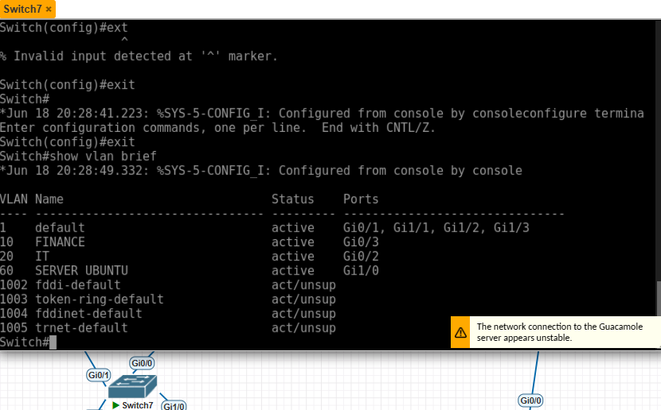

#### Langkah 4: Konfigurasi Access Port untuk Setiap VLAN

Tentukan interface yang terhubung ke masing-masing klien dan Ubuntu Server, kemudian konfigurasikan sebagai access port sesuai VLAN tujuan.

```
interface gi0/1
 description CLIENT-VLAN10-FINANCE
 switchport mode access
 switchport access vlan 10
 no shutdown
exit

interface gi0/2
 description CLIENT-VLAN20-IT
 switchport mode access
 switchport access vlan 20
 no shutdown
exit

interface gi0/3
 description UBUNTU-SERVER-VLAN60
 switchport mode access
 switchport access vlan 60
 no shutdown
exit
```

#### Langkah 5: Konfigurasi Trunk Port ke Cisco Router Jakarta

Konfigurasikan interface yang terhubung ke Cisco Router Jakarta sebagai trunk port yang membawa VLAN 10, VLAN 20, dan VLAN 60.

```
interface gi0/0
 switchport trunk encapsulation dot1q
 description TRUNK-TO-CISCO-ROUTER-JAKARTA
 switchport mode trunk
 switchport trunk allowed vlan 10,20,60
 no shutdown
exit
```

#### Langkah 6: Konfigurasi Trunk Port ke MikroTik Router Jakarta

Konfigurasikan interface yang terhubung ke MikroTik Router Jakarta sebagai trunk port yang membawa VLAN 10, VLAN 20, dan VLAN 60.

```
interface gi1/0
 switchport trunk encapsulation dot1q
 description TRUNK-TO-MIKROTIK-JAKARTA
 switchport mode trunk
 switchport trunk allowed vlan 10,20,60
 no shutdown
exit
```

#### Langkah 7: Verifikasi Konfigurasi Trunk

Lakukan verifikasi untuk memastikan kedua trunk port sudah aktif dan membawa VLAN yang sesuai.

```
show interfaces trunk
```

Gambar berikut menunjukkan hasil keluaran perintah `show interfaces trunk` pada Cisco Switch Jakarta.

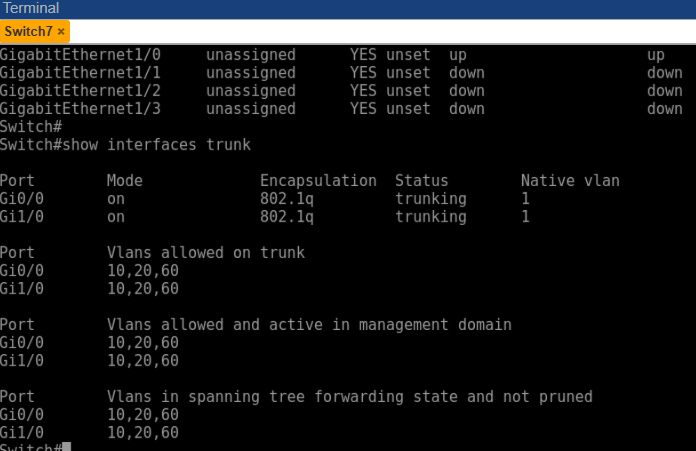

#### Langkah 8: Menyimpan Konfigurasi

Simpan seluruh konfigurasi agar tidak hilang ketika perangkat dimatikan atau di-reload.

```
write memory
```

### 2.4 Bukti Percobaan

1. Screenshot topologi bagian Jakarta.


2. Screenshot hasil perintah `show vlan brief`.


3. Screenshot hasil perintah `show interfaces trunk`.


### 2.5 Hasil yang Diharapkan

1. VLAN 10, VLAN 20, dan VLAN 60 berhasil dibuat dan berstatus aktif.
2. Klien VLAN 10 berada pada segmen VLAN 10.
3. Klien VLAN 20 berada pada segmen VLAN 20.
4. Ubuntu Server berada pada segmen VLAN 60.
5. Link ke Cisco Router Jakarta dan MikroTik Router Jakarta aktif sebagai trunk.
6. VLAN 10, VLAN 20, dan VLAN 60 dapat melewati trunk port tanpa terhalang.

### 2.6 Analisis

Konfigurasi VLAN pada Cisco Switch Jakarta bertujuan membentuk segmentasi jaringan logis sehingga lalu lintas data antara Finance, IT, dan segmen server terisolasi satu sama lain meskipun berada pada perangkat fisik yang sama. Access port pada VLAN 10, VLAN 20, dan VLAN 60 mengirimkan frame tanpa label VLAN (untagged) karena hanya melayani satu VLAN tertentu, sedangkan trunk port menuju Cisco Router dan MikroTik Router menggunakan enkapsulasi IEEE 802.1Q agar dapat membawa beberapa VLAN sekaligus melalui satu jalur fisik.

Penggunaan dua trunk port, yaitu menuju Cisco Router dan menuju MikroTik Router, memungkinkan kedua router tersebut menerima trafik dari ketiga VLAN secara bersamaan. Kondisi ini menjadi dasar bagi implementasi VRRP pada tugas modul berikutnya karena kedua router memerlukan akses langsung ke setiap VLAN untuk dapat berfungsi sebagai pasangan master dan backup gateway. Apabila trunk port tidak dikonfigurasi dengan benar atau VLAN yang diizinkan tidak sesuai, maka salah satu router tidak akan menerima trafik broadcast VRRP sehingga mekanisme failover tidak dapat berjalan.

---

## 3. Tugas Modul 2: Konfigurasi Cisco Router Jakarta

### 3.1 Perangkat yang Dikonfigurasi

Cisco Router Jakarta.

### 3.2 Tujuan

1. Membuat subinterface untuk VLAN 10, VLAN 20, dan VLAN 60.
2. Memberikan IP fisik pada setiap subinterface.
3. Mengonfigurasi VRRP untuk VLAN 10, VLAN 20, dan VLAN 60.
4. Mengatur Cisco Router sebagai VRRP master untuk VLAN 10 dan VLAN 60.
5. Mengonfigurasi DHCP Relay menuju Ubuntu Server Jakarta.
6. Mengonfigurasi link dari Cisco Router Jakarta ke FortiGate Jakarta.
7. Menambahkan default route menuju FortiGate Jakarta.

### 3.3 Langkah Percobaan

#### Langkah 1: Masuk ke Mode Konfigurasi Global

```
enable
configure terminal
```

#### Langkah 2: Konfigurasi Interface Trunk ke Cisco Switch Jakarta

Pilih interface yang terhubung ke Cisco Switch Jakarta, kemudian nonaktifkan IP address pada interface utama karena IP akan diberikan pada masing-masing subinterface.

```
interface gi0/1
 description TRUNK-TO-CISCO-SWITCH-JAKARTA
 no ip address
 no shutdown
exit
```

#### Langkah 3: Konfigurasi Subinterface VLAN 10

```
interface gi0/1.10
 description GATEWAY-VLAN10-FINANCE
 encapsulation dot1Q 10
 ip address 192.168.10.2 255.255.255.0
 no shutdown
exit
```

#### Langkah 4: Konfigurasi Subinterface VLAN 20

```
interface gi0/1.20
 description GATEWAY-VLAN20-IT
 encapsulation dot1Q 20
 ip address 192.168.20.2 255.255.255.0
 no shutdown
exit
```

#### Langkah 5: Konfigurasi Subinterface VLAN 60

```
interface gi0/1.60
 description GATEWAY-VLAN60-SERVER
 encapsulation dot1Q 60
 ip address 192.168.60.2 255.255.255.0
 no shutdown
exit
```

#### Langkah 6: Verifikasi IP pada Setiap Subinterface

```
show ip interface brief
```

Gambar berikut menunjukkan hasil keluaran perintah `show ip interface brief` pada Cisco Router Jakarta.

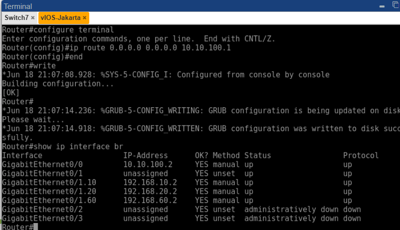

#### Langkah 7: Konfigurasi VRRP untuk VLAN 10

Cisco Router diatur sebagai VRRP master pada VLAN 10 dengan memberikan nilai priority yang lebih tinggi dibandingkan MikroTik Router.

```
interface gi0/1.10
 vrrp 10 ip 192.168.10.1
 vrrp 10 priority 110
exit
```

#### Langkah 8: Konfigurasi VRRP untuk VLAN 20

Cisco Router diatur sebagai VRRP backup pada VLAN 20 karena MikroTik Router bertindak sebagai master pada VLAN ini.

```
interface gi0/1.20
 vrrp 20 ip 192.168.20.1
 vrrp 20 priority 90
exit
```

#### Langkah 9: Konfigurasi VRRP untuk VLAN 60

Cisco Router diatur sebagai VRRP master pada VLAN 60.

```
interface gi0/1.60
 vrrp 60 ip 192.168.60.1
 vrrp 60 priority 110
exit
```

#### Langkah 10: Verifikasi Status VRRP

```
show vrrp brief
```

Gambar berikut menunjukkan hasil keluaran perintah `show vrrp brief` pada Cisco Router Jakarta.

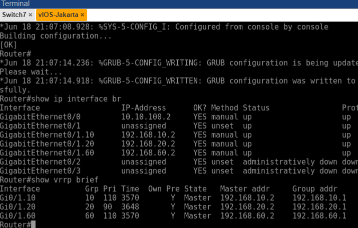

#### Langkah 11: Konfigurasi DHCP Relay menuju Ubuntu Server Jakarta

DHCP Relay diperlukan agar permintaan DHCP dari klien VLAN 10 dan VLAN 20 dapat diteruskan menuju Ubuntu Server Jakarta yang berada pada VLAN 60.

```
interface gi0/1.10
 ip helper-address 192.168.60.10
exit

interface gi0/1.20
 ip helper-address 192.168.60.10
exit
```

#### Langkah 12: Konfigurasi Link ke FortiGate Jakarta

```
interface gi0/0
 description LINK-TO-FORTIGATE-JAKARTA
 ip address 10.10.100.2 255.255.255.252
 no shutdown
exit
```

#### Langkah 13: Menambahkan Default Route menuju FortiGate Jakarta

```
ip route 0.0.0.0 0.0.0.0 10.10.100.1
```

#### Langkah 14: Verifikasi Konektivitas ke FortiGate Jakarta

```
ping 10.10.100.1
```

Gambar berikut menunjukkan hasil ping dari Cisco Router Jakarta ke FortiGate Jakarta.

```
CISCO-JAKARTA#ping 10.10.100.1
Type escape sequence to abort.
Sending 5, 100-byte ICMP Echos to 10.10.100.1, timeout is 2 seconds:
!!!!!
Success rate is 100 percent (5/5), round-trip min/avg/max = 1/1/2 ms
CISCO-JAKARTA#
```

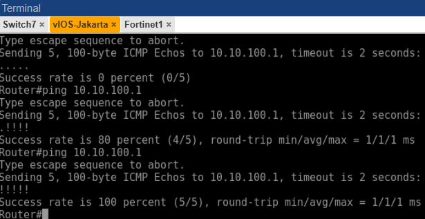

#### Langkah 15: Menyimpan Konfigurasi

```
write memory
```

### 3.4 Bukti Percobaan

1. Screenshot hasil perintah `show ip interface brief`.


2. Screenshot hasil perintah `show vrrp brief`.


3. Screenshot konfigurasi subinterface VLAN 10, VLAN 20, dan VLAN 60.

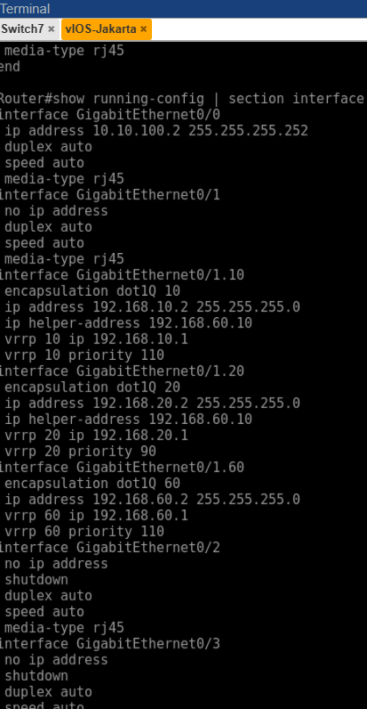

4. Screenshot hasil ping dari Cisco Router Jakarta ke FortiGate Jakarta.


### 3.5 Hasil yang Diharapkan

1. Cisco Router memiliki subinterface VLAN 10, VLAN 20, dan VLAN 60.
2. Cisco Router ikut menjalankan VRRP bersama MikroTik Router Jakarta.
3. Cisco Router menjadi gateway aktif untuk VLAN 10 dan VLAN 60.
4. Cisco Router dapat meneruskan permintaan DHCP ke Ubuntu Server Jakarta.
5. Cisco Router dapat terhubung dan melakukan ping ke FortiGate Jakarta.

### 3.6 Analisis

Pembuatan subinterface pada Cisco Router Jakarta merupakan implementasi konsep router-on-a-stick, yaitu satu interface fisik yang dibagi menjadi beberapa subinterface logis menggunakan enkapsulasi dot1Q sesuai VLAN ID masing-masing. Pendekatan ini efisien karena router cukup menggunakan satu kabel fisik untuk melayani seluruh VLAN yang dibawa melalui trunk port dari Cisco Switch.

Mekanisme VRRP yang diterapkan pada VLAN 10, VLAN 20, dan VLAN 60 menghasilkan satu gateway virtual yang sama meskipun terdapat dua router fisik, yaitu Cisco Router dan MikroTik Router. Pengaturan priority menentukan router mana yang menjadi master pada setiap VLAN. Cisco Router diberi priority lebih tinggi pada VLAN 10 dan VLAN 60 sehingga menjadi gateway aktif, sedangkan pada VLAN 20 priority Cisco Router diatur lebih rendah agar MikroTik Router menjadi master. Pembagian peran ini menciptakan keseimbangan beban antara kedua router sekaligus menyediakan redundansi, karena ketika salah satu router mengalami gangguan, router pasangannya akan otomatis mengambil alih peran gateway tanpa mengubah IP virtual yang digunakan klien.

Konfigurasi DHCP Relay pada subinterface VLAN 10 dan VLAN 20 diperlukan karena Ubuntu Server sebagai DHCP Server berada pada VLAN 60 yang berbeda segmen dengan klien. Tanpa DHCP Relay, paket broadcast DHCP Discover dari klien tidak akan pernah mencapai DHCP Server karena bersifat broadcast yang tidak dapat melewati batas router secara default. Perintah `ip helper-address` mengubah trafik broadcast tersebut menjadi unicast yang diarahkan langsung ke alamat Ubuntu Server.

---

## 4. Tugas Modul 3: Konfigurasi MikroTik Router Jakarta

### 4.1 Perangkat yang Dikonfigurasi

MikroTik Router Jakarta.

### 4.2 Tujuan

1. Membuat VLAN interface untuk VLAN 10, VLAN 20, dan VLAN 60.
2. Memberikan IP fisik pada setiap VLAN interface.
3. Mengonfigurasi VRRP untuk VLAN 10, VLAN 20, dan VLAN 60.
4. Mengatur MikroTik sebagai VRRP master untuk VLAN 20.
5. Mengonfigurasi DHCP Relay menuju Ubuntu Server Jakarta.
6. Mengonfigurasi link dari MikroTik Jakarta ke FortiGate Jakarta.
7. Menambahkan default route menuju FortiGate Jakarta.

### 4.3 Langkah Percobaan

#### Langkah 1: Masuk ke Terminal MikroTik

Akses MikroTik Router Jakarta melalui terminal atau Winbox, kemudian masuk ke mode terminal CLI.

#### Langkah 2: Membuat VLAN Interface untuk VLAN 10, VLAN 20, dan VLAN 60

Interface fisik yang terhubung ke Cisco Switch Jakarta dijadikan parent interface untuk VLAN interface berikut.

```
/interface vlan add name=vlan10-finance vlan-id=10 interface=ether2
/interface vlan add name=vlan20-it vlan-id=20 interface=ether2
/interface vlan add name=vlan60-server interface=ether2 vlan-id=60
```

#### Langkah 3: Memberikan IP Address pada Setiap VLAN Interface

```
/ip address add address=192.168.10.3/24 interface=vlan10-finance comment="VLAN10-FINANCE"
/ip address add address=192.168.20.3/24 interface=vlan20-it comment="VLAN20-IT"
/ip address add address=192.168.60.3/24 interface=vlan60-server comment="VLAN60-SERVER"
```

#### Langkah 4: Konfigurasi Link ke FortiGate Jakarta

```
/ip address add address=10.10.101.2/30 interface=ether1 comment="TO-FORTINET"
```

#### Langkah 5: Verifikasi IP Address

```
/ip address print
```

Gambar berikut menunjukkan hasil keluaran perintah `/ip address print` pada MikroTik Router Jakarta.

```
[admin@Mikrotik-Jakarta] > ip address print
Flags: X - disabled, I - invalid, D - dynamic 
 #   ADDRESS            NETWORK         INTERFACE                                     
 0   192.168.10.3/24    192.168.10.0    vlan10-finance                                
 1   192.168.20.3/24    192.168.20.0    vlan20-it                                     
 2   192.168.60.3/24    192.168.60.0    vlan60-ubuntu-server                          
 3   ;;; TO-FORTINET
     10.10.101.2/30     10.10.101.0     ether1                                        
 4   192.168.20.1/32    192.168.20.1    vrrp20                                        
 5   192.168.10.1/32    192.168.10.1    vrrp10                                        
 6   192.168.60.1/32    192.168.60.1    vrrp60                                        
[admin@Mikrotik-Jakarta] > 
```

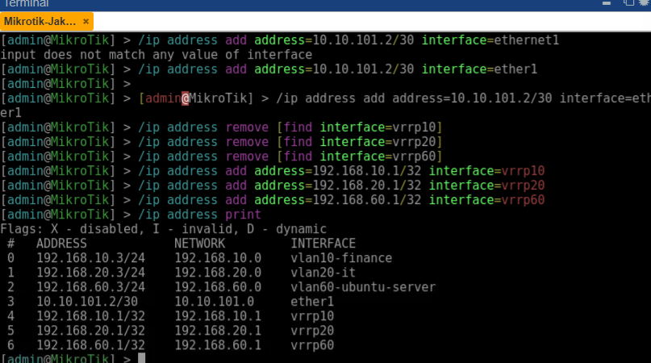

#### Langkah 6: Konfigurasi VRRP untuk VLAN 10

MikroTik diatur sebagai VRRP backup pada VLAN 10 karena Cisco Router bertindak sebagai master.

```
/interface vrrp add name=vrrp10 interface=vlan10-finance vrid=10 priority=90 version=3
/ip address add address=192.168.10.1/32 interface=vrrp10
```

#### Langkah 7: Konfigurasi VRRP untuk VLAN 20

MikroTik diatur sebagai VRRP master pada VLAN 20 dengan priority lebih tinggi dibandingkan Cisco Router.

```
/interface vrrp add name=vrrp20 interface=vlan20-it vrid=20 priority=120 version=3
/ip address add address=192.168.20.1/32 interface=vrrp20
```

#### Langkah 8: Konfigurasi VRRP untuk VLAN 60

MikroTik diatur sebagai VRRP backup pada VLAN 60.

```
/interface vrrp add name=vrrp60 interface=vlan60-server vrid=60 priority=90 version=3
/ip address add address=192.168.60.1/32 interface=vrrp60
```

#### Langkah 9: Verifikasi Status VRRP

```
/interface vrrp print
```

Gambar berikut menunjukkan hasil keluaran perintah `/interface vrrp print`. Flag `M` menandakan router berperan sebagai master pada VLAN tersebut.

```
[admin@Mikrotik-Jakarta] > interface vrrp print
Flags: X - disabled, I - invalid, R - running, M - master, B - backup 
 #     NAME         INTERFACE    MAC-ADDRESS       VRI PRI INTERVAL             V V3..
 0  RM vrrp10       vlan10-fi... 00:00:5E:00:01:0A  10  90 1s                   3 ipv4
 1  RM vrrp20       vlan20-it    00:00:5E:00:01:14  20 120 1s                   3 ipv4
 2  RM vrrp60       vlan60-ub... 00:00:5E:00:01:3C  60  90 1s                   3 ipv4
[admin@Mikrotik-Jakarta] > 
```

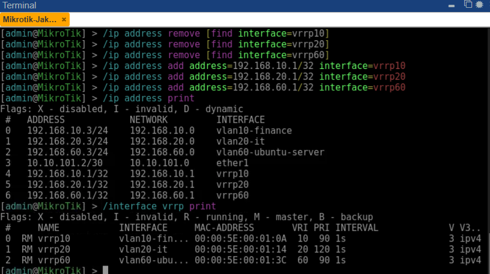

#### Langkah 10: Konfigurasi DHCP Relay menuju Ubuntu Server Jakarta

DHCP Relay dikonfigurasi pada VLAN 10 dan VLAN 20 menuju Ubuntu Server Jakarta dengan local-address mengikuti IP MikroTik pada VLAN yang bersangkutan.

```
/ip dhcp-relay add name=relay-vlan10 interface=vlan10-finance dhcp-server=192.168.60.10 local-address=192.168.10.3 disabled=no
/ip dhcp-relay add name=relay-vlan20 interface=vlan20-it dhcp-server=192.168.60.10 local-address=192.168.20.3 disabled=no
```

#### Langkah 11: Verifikasi DHCP Relay

```
/ip dhcp-relay print
```

Gambar berikut menunjukkan hasil keluaran perintah `/ip dhcp-relay print`.

```
[admin@Mikrotik-Jakarta] > ip dhcp-relay print
Flags: X - disabled, I - invalid 
 #   NAME                   INTERFACE                  DHCP-SERVER     LOCAL-ADDRESS  
 0   relay-vlan10           vlan10-finance             192.168.60.10   192.168.10.3   
 1   relay-vlan20           vlan20-it                  192.168.60.10   192.168.20.3   
[admin@Mikrotik-Jakarta] > 
```

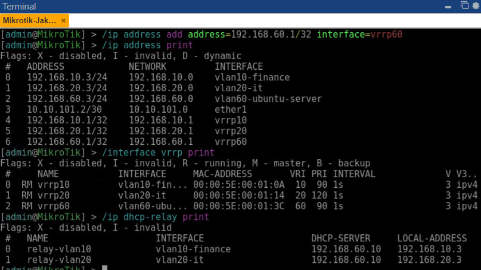

#### Langkah 12: Menambahkan Default Route menuju FortiGate Jakarta

```
/ip route add dst-address=0.0.0.0/0 gateway=10.10.101.1
```

#### Langkah 13: Verifikasi Routing Table

```
/ip route print
```

Gambar berikut menunjukkan hasil keluaran perintah `/ip route print` pada MikroTik Router Jakarta.

```
[admin@Mikrotik-Jakarta] > ip route print
Flags: X - disabled, A - active, D - dynamic, 
C - connect, S - static, r - rip, b - bgp, o - ospf, m - mme, 
B - blackhole, U - unreachable, P - prohibit 
 #      DST-ADDRESS        PREF-SRC        GATEWAY            DISTANCE
 0 A S  0.0.0.0/0                          10.10.101.1               1
 1 ADC  10.10.101.0/30     10.10.101.2     ether1                    0
 2 ADC  192.168.10.0/24    192.168.10.3    vlan10-finance            0
 3 ADC  192.168.10.1/32    192.168.10.1    vrrp10                    0
 4 ADC  192.168.20.0/24    192.168.20.3    vlan20-it                 0
 5 ADC  192.168.20.1/32    192.168.20.1    vrrp20                    0
 6 ADC  192.168.60.0/24    192.168.60.3    vlan60-ubuntu-s...        0
 7 ADC  192.168.60.1/32    192.168.60.1    vrrp60                    0
[admin@Mikrotik-Jakarta] > 
```

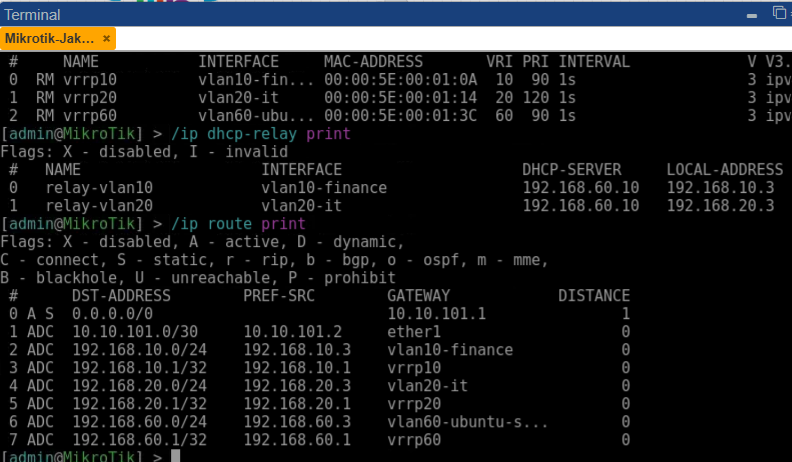

#### Langkah 14: Verifikasi Konektivitas ke FortiGate Jakarta

```
/ping 10.10.101.1
```

Gambar berikut menunjukkan hasil ping dari MikroTik Router Jakarta ke FortiGate Jakarta.

```
[admin@Mikrotik-Jakarta] > ping 10.10.101.1
  SEQ HOST                                     SIZE TTL TIME  STATUS                  
    0 10.10.101.1                                56 255 1ms  
    1 10.10.101.1                                56 255 0ms  
    2 10.10.101.1                                56 255 0ms  
    3 10.10.101.1                                56 255 0ms  
    4 10.10.101.1                                56 255 0ms  
    sent=5 received=5 packet-loss=0% min-rtt=0ms avg-rtt=0ms max-rtt=1ms 

[admin@Mikrotik-Jakarta] > 
```

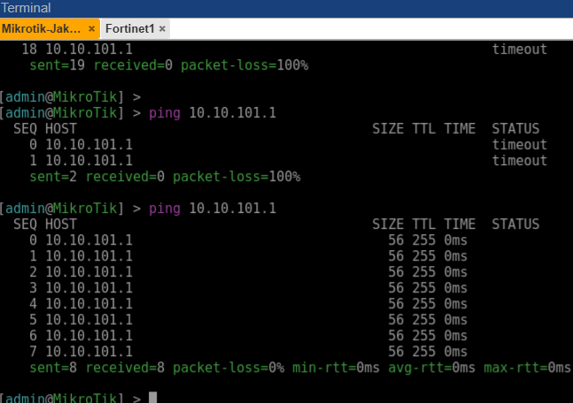

### 4.4 Bukti Percobaan

1. Screenshot hasil perintah `/ip address print`.


2. Screenshot hasil perintah `/interface vrrp print`.


3. Screenshot hasil perintah `/ip dhcp-relay print`.


4. Screenshot hasil perintah `/ip route print`.


5. Screenshot hasil ping dari MikroTik ke FortiGate Jakarta.


### 4.5 Hasil yang Diharapkan

1. MikroTik Router memiliki VLAN interface untuk VLAN 10, VLAN 20, dan VLAN 60.
2. MikroTik ikut menjalankan VRRP bersama Cisco Router.
3. MikroTik menjadi gateway aktif untuk VLAN 20.
4. MikroTik dapat meneruskan permintaan DHCP ke Ubuntu Server Jakarta.
5. MikroTik dapat terhubung dan melakukan ping ke FortiGate Jakarta.

### 4.6 Analisis

Konfigurasi pada MikroTik Router Jakarta melengkapi mekanisme dual gateway yang telah dimulai pada Tugas Modul 2. Penggunaan VLAN interface pada MikroTik secara fungsional setara dengan subinterface pada Cisco Router, yaitu memisahkan trafik VLAN 10, VLAN 20, dan VLAN 60 melalui satu interface fisik yang sama dengan memanfaatkan tag 802.1Q.

Pembagian peran VRRP terlihat saling melengkapi dengan konfigurasi pada Cisco Router. Pada VLAN 10 dan VLAN 60, MikroTik berperan sebagai backup dengan priority 90, sedangkan pada VLAN 20, MikroTik berperan sebagai master dengan priority 120. Pola pembagian ini menyebabkan beban trafik gateway tidak seluruhnya ditangani oleh satu perangkat saja, sehingga utilisasi kedua router lebih merata dan risiko downtime menyeluruh akibat kegagalan satu perangkat dapat diminimalkan.

Pengujian ping dari MikroTik ke FortiGate Jakarta dengan hasil round-trip time yang sangat rendah, yaitu rata-rata 0 milidetik hingga 1 milidetik, menunjukkan bahwa link transit antara MikroTik Jakarta dan FortiGate Jakarta pada jaringan 10.10.101.0/30 berfungsi dengan baik tanpa adanya packet loss. Hasil ini menjadi prasyarat penting sebelum melanjutkan konfigurasi pada FortiGate Jakarta di Tugas Modul 5, karena seluruh trafik dari VLAN 20 menuju internet maupun menuju Surabaya akan melewati jalur ini ketika MikroTik berperan sebagai gateway aktif.

---

## 5. Tugas Modul 4: Konfigurasi Ubuntu Server Jakarta

### 5.1 Perangkat yang Dikonfigurasi

Ubuntu Server Jakarta.

### 5.2 Catatan Penting Sebelum Konfigurasi

1. Sebelum menghubungkan Ubuntu Server ke Cisco Switch, hubungkan terlebih dahulu ke jaringan management.
2. Setelah terhubung ke jaringan management dan memperoleh IP secara DHCP, lakukan instalasi seluruh paket yang dibutuhkan, yaitu ISC-DHCP Server dan Nginx.
3. Setelah instalasi ISC-DHCP Server dan Nginx selesai, hubungkan Ubuntu Server ke Cisco Switch pada VLAN 60, kemudian konfigurasikan IP statis.

### 5.3 Tujuan

1. Mengonfigurasi IP statis Ubuntu Server pada VLAN 60.
2. Mengatur default gateway Ubuntu Server menuju virtual IP VRRP VLAN 60.
3. Menginstal ISC-DHCP Server.
4. Membuat DHCP pool untuk VLAN 10 dan VLAN 20.
5. Memastikan gateway yang diberikan oleh DHCP adalah IP virtual VRRP.
6. Menginstal Nginx sebagai web server Jakarta.
7. Mengubah halaman web menjadi identitas server Jakarta.

### 5.4 Langkah Percobaan

#### Langkah 1: Konfigurasi IP Statis pada VLAN 60

Buka berkas konfigurasi netplan, kemudian atur IP statis sesuai dengan alamat yang telah ditentukan pada tabel pengalamatan.

```
sudo nano /etc/netplan/00-installer-config.yaml
```

Isi konfigurasi netplan sebagai berikut.

```yaml
network:
  version: 2
  ethernets:
    eth0:
      dhcp4: no
      addresses:
        - 192.168.60.10/24
      routes:
        - to: default
          via: 192.168.60.1
      nameservers:
        addresses: [8.8.8.8, 1.1.1.1]
```

Terapkan konfigurasi netplan.

```
sudo netplan apply
```

#### Langkah 2: Verifikasi IP Address

```
ip a
```

Gambar berikut menunjukkan hasil keluaran perintah `ip a` pada Ubuntu Server Jakarta.

```
2: eth0: <BROADCAST,MULTICAST,UP,LOWER_UP> mtu 1500 qdisc fq_codel state UP group default qlen 1000
    link/ether 50:8c:e5:00:ef:00 brd ff:ff:ff:ff:ff:ff
    inet 192.168.60.10/24 brd 192.168.60.255 scope global eth0
       valid_lft forever preferred_lft forever
    inet6 fe80::528c:e5ff:fe00:ef00/64 scope link 
       valid_lft forever preferred_lft forever
root@kvm:/# 
```

#### Langkah 3: Verifikasi Default Route

```
ip route
```

Gambar berikut menunjukkan hasil keluaran perintah `ip route` pada Ubuntu Server Jakarta.

```
root@kvm:/# ip route
default via 192.168.60.1 dev eth0 proto static 
192.168.60.0/24 dev eth0 proto kernel scope link src 192.168.60.10 
root@kvm:/# 
```

#### Langkah 4: Instalasi ISC-DHCP Server

```
sudo apt update
sudo apt install isc-dhcp-server -y
```

#### Langkah 5: Konfigurasi Interface DHCP

Tentukan interface yang digunakan oleh ISC-DHCP Server pada berkas `/etc/default/isc-dhcp-server`.

```
sudo nano /etc/default/isc-dhcp-server
```

```
INTERFACESv4="eth0"
```

#### Langkah 6: Konfigurasi DHCP Pool untuk VLAN 10, VLAN 20, dan VLAN 60

Edit berkas konfigurasi utama ISC-DHCP Server.

```
sudo nano /etc/dhcp/dhcpd.conf
```

Isi konfigurasi sesuai dengan kebutuhan tiga subnet, dengan gateway yang diarahkan ke IP virtual VRRP masing-masing VLAN.

```
authoritative;

default-lease-time 600;
max-lease-time 7200;

# DNS
option domain-name-servers 8.8.8.8, 1.1.1.1;

# VLAN 10 - Finance
subnet 192.168.10.0 netmask 255.255.255.0 {
  range 192.168.10.100 192.168.10.200;
  option routers 192.168.10.1;
  option subnet-mask 255.255.255.0;
  option broadcast-address 192.168.10.255;
}

# VLAN 20 - IT
subnet 192.168.20.0 netmask 255.255.255.0 {
  range 192.168.20.100 192.168.20.200;
  option routers 192.168.20.1;
  option subnet-mask 255.255.255.0;
  option broadcast-address 192.168.20.255;
}

# VLAN 60 - Server Network
subnet 192.168.60.0 netmask 255.255.255.0 {
  option routers 192.168.60.1;
  option subnet-mask 255.255.255.0;
  option broadcast-address 192.168.60.255;
}
```

#### Langkah 7: Verifikasi Isi Berkas Konfigurasi DHCP

```
sudo cat /etc/dhcp/dhcpd.conf
```

Gambar berikut menunjukkan isi berkas `/etc/dhcp/dhcpd.conf` pada Ubuntu Server Jakarta.


#### Langkah 8: Menjalankan dan Mengaktifkan Layanan ISC-DHCP Server

```
sudo systemctl restart isc-dhcp-server
sudo systemctl enable isc-dhcp-server
sudo systemctl status isc-dhcp-server
```


#### Langkah 9: Instalasi Nginx Web Server

```
sudo apt install nginx -y
```

#### Langkah 10: Mengubah Halaman Web Menjadi Identitas Server Jakarta

```
sudo nano /var/www/html/index.nginx-debian.html
```

Ubah isi berkas menjadi identitas server Jakarta, sebagai contoh:

```html
<!DOCTYPE html>
<html>
<head><title>Server Jakarta</title></head>
<body>
<h1>Selamat datang di Web Server HQ Jakarta</h1>
<p>Ubuntu Server - VLAN 60 - 192.168.60.10</p>
</body>
</html>
```

#### Langkah 11: Verifikasi Layanan Nginx

```
sudo systemctl restart nginx
sudo systemctl status nginx
```


#### Langkah 12: Pengujian Akses Internet dari Ubuntu Server

```
ping 8.8.8.8
```

Gambar berikut menunjukkan hasil ping dari Ubuntu Server Jakarta ke 8.8.8.8.

```
root@kvm:/# ping 8.8.8.8
PING 8.8.8.8 (8.8.8.8) 56(84) bytes of data.
64 bytes from 8.8.8.8: icmp_seq=3 ttl=109 time=25.7 ms
64 bytes from 8.8.8.8: icmp_seq=4 ttl=109 time=24.0 ms
^C
--- 8.8.8.8 ping statistics ---
10 packets transmitted, 2 received, 80% packet loss, time 9132ms
rtt min/avg/max/mdev = 24.003/24.871/25.740/0.868 ms
root@kvm:/# 
```

### 5.5 Bukti Percobaan

1. Screenshot hasil perintah `ip a`.

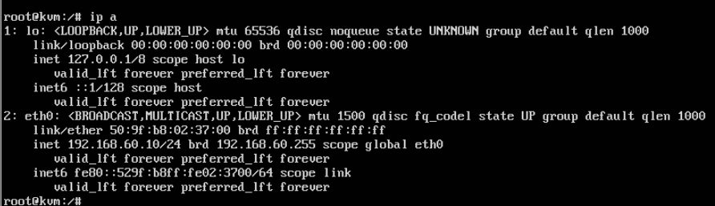

2. Screenshot hasil perintah `ip route`.

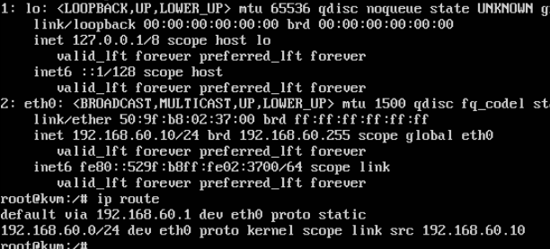

3. Screenshot isi berkas `/etc/dhcp/dhcpd.conf`.

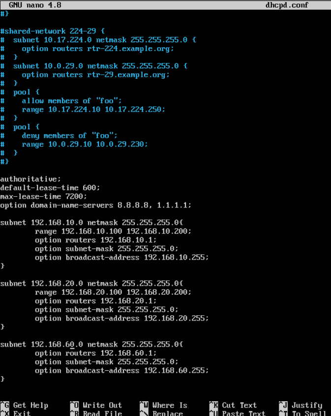

4. Screenshot hasil `ping 8.8.8.8`.

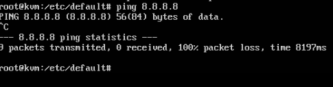

### 5.6 Hasil yang Diharapkan

1. Ubuntu Server dapat mengakses internet.
2. ISC-DHCP Server berjalan dengan normal.
3. Klien VLAN 10 mendapatkan IP DHCP dari Ubuntu Server.
4. Klien VLAN 20 mendapatkan IP DHCP dari Ubuntu Server.
5. Web server Nginx dapat diakses dari jaringan Jakarta dan Surabaya.

### 5.7 Analisis

Tahapan instalasi pada Ubuntu Server Jakarta dilakukan secara berurutan, yaitu menghubungkan ke jaringan management terlebih dahulu sebelum dipindahkan ke VLAN 60. Urutan ini penting karena proses instalasi paket ISC-DHCP Server dan Nginx memerlukan akses internet, sedangkan pada konfigurasi akhir, Ubuntu Server tidak diberi akses langsung ke internet kecuali melalui jalur VLAN 60 yang melewati VRRP gateway dan FortiGate.

Pengaturan `option routers` pada setiap subnet di dalam `dhcpd.conf` diarahkan ke IP virtual VRRP, bukan ke IP fisik salah satu router. Pendekatan ini menjamin bahwa klien yang menerima IP secara DHCP akan selalu mengarahkan trafik ke gateway yang sama, meskipun secara fisik gateway tersebut dapat ditangani secara bergantian oleh Cisco Router atau MikroTik Router sesuai dengan status VRRP yang aktif saat itu. Jika gateway diarahkan ke IP fisik salah satu router, maka mekanisme failover VRRP tidak akan memberikan manfaat penuh karena klien tetap mengarah ke perangkat yang sama walaupun perangkat tersebut sedang tidak aktif.

Hasil pengujian ping ke 8.8.8.8 yang menunjukkan packet loss 80 persen pada percobaan ini mengindikasikan bahwa proses pengujian dilakukan bersamaan dengan proses inisialisasi atau perpindahan jaringan, sehingga beberapa paket awal hilang sebelum koneksi benar-benar stabil. Kondisi ini wajar terjadi pada simulasi GNS3 atau PNETLab ketika interface baru saja diaktifkan, dan tidak mengindikasikan adanya masalah pada konfigurasi routing.

---

## 6. Tugas Modul 5: Konfigurasi FortiGate Jakarta

### 6.1 Perangkat yang Dikonfigurasi

FortiGate Jakarta.

### 6.2 Tujuan

1. Mengonfigurasi interface ke Cisco Router Jakarta.
2. Mengonfigurasi interface ke MikroTik Router Jakarta.
3. Mengonfigurasi interface ke MikroTik ISP.
4. Menambahkan default route menuju MikroTik ISP.
5. Menambahkan static route menuju network internal Jakarta.
6. Membuat firewall policy dari jaringan Jakarta ke internet.
7. Mengaktifkan NAT untuk trafik internet.
8. Mengonfigurasi GRE Tunnel menuju FortiGate Surabaya.
9. Mengonfigurasi OSPF over GRE.
10. Mengaktifkan redistribute static route ke OSPF.

### 6.3 Langkah Percobaan

#### Langkah 1: Konfigurasi Interface port1 menuju Cisco Router Jakarta

Masuk ke menu konfigurasi interface pada FortiGate, kemudian atur port1 dengan mode statis.

```
config system interface
    edit "port1"
        set mode static
        set ip 10.10.100.1 255.255.255.252
        set allowaccess ping
    next
end
```

#### Langkah 2: Konfigurasi Interface port2 menuju MikroTik Router Jakarta

```
config system interface
    edit "port2"
        set mode static
        set ip 10.10.101.1 255.255.255.252
        set allowaccess ping
    next
end
```

#### Langkah 3: Konfigurasi Interface port3 menuju MikroTik ISP

```
config system interface
    edit "port3"
        set mode static
        set ip 10.0.12.2 255.255.255.252
        set allowaccess ping
    next
end
```

#### Langkah 4: Verifikasi Status Interface Fisik

```
get system interface physical
```

Gambar berikut menunjukkan hasil keluaran perintah `get system interface physical` pada FortiGate Jakarta.

```
Fortinet-Jakarta # get system interface physical 
== [onboard]
	==[port1]
		mode: static
		ip: 10.10.100.1 255.255.255.252
		ipv6: ::/0
		status: up
		speed: 10000Mbps (Duplex: full)
		FEC: none
		FEC_cap: none
	==[port2]
		mode: static
		ip: 10.10.101.1 255.255.255.252
		ipv6: ::/0
		status: up
		speed: 10000Mbps (Duplex: full)
		FEC: none
		FEC_cap: none
	==[port3]
		mode: static
		ip: 10.0.12.2 255.255.255.252
		ipv6: ::/0
		status: up
		speed: 10000Mbps (Duplex: full)
		FEC: none
                FEC_cap: none
```

#### Langkah 5: Menambahkan Default Route menuju MikroTik ISP

```
config router static
    edit 1
        set dst 0.0.0.0 0.0.0.0
        set gateway 10.0.12.1
        set device "port3"
    next
end
```

#### Langkah 6: Menambahkan Static Route menuju Network Internal Jakarta

```
config router static
    edit 2
        set dst 192.168.10.0 255.255.255.0
        set gateway 10.10.100.2
        set device "port1"
    next
    edit 3
        set dst 192.168.20.0 255.255.255.0
        set gateway 10.10.101.2
        set device "port2"
    next
    edit 4
        set dst 192.168.60.0 255.255.255.0
        set gateway 10.10.100.2
        set device "port1"
    next
end
```

#### Langkah 7: Verifikasi Routing Table

```
get router info routing-table all
```

Amati apakah default route menuju MikroTik ISP dan static route menuju VLAN 10, VLAN 20, dan VLAN 60 telah tampil pada tabel routing.


#### Langkah 8: Membuat Address Object untuk Network Internal Jakarta

```
config firewall address
    edit "NET-JAKARTA-ALL"
        set subnet 192.168.0.0 255.255.0.0
    next
end
```

#### Langkah 9: Membuat Firewall Policy dari Jaringan Jakarta menuju Internet

```
config firewall policy
    edit 1
        set name "JAKARTA-TO-INTERNET"
        set srcintf "port1" "port2"
        set dstintf "port3"
        set srcaddr "NET-JAKARTA-ALL"
        set dstaddr "all"
        set action accept
        set schedule "always"
        set service "ALL"
        set nat enable
    next
end
```


#### Langkah 10: Pengujian Akses Internet

```
execute ping 8.8.8.8
```

Gambar berikut menunjukkan hasil ping FortiGate Jakarta menuju 8.8.8.8.


#### Langkah 11: Konfigurasi GRE Tunnel menuju FortiGate Surabaya

```
config system gre-tunnel
    edit "GRE-JKT-SBY"
        set interface "port3"
        set remote-gw 10.0.13.2
        set local-gw 10.0.12.2
    next
end
```

#### Langkah 12: Memberikan IP Tunnel pada Interface GRE

```
config system interface
    edit "GRE-JKT-SBY"
        set ip 172.16.0.1 255.255.255.255
        set remote-ip 172.16.0.2 255.255.255.255
        set allowaccess ping
    next
end
```

#### Langkah 13: Pengujian Ping ke IP Tunnel Surabaya

```
execute ping 172.16.0.2
```

Gambar berikut menunjukkan hasil ping dari FortiGate Jakarta ke IP tunnel FortiGate Surabaya.


#### Langkah 14: Konfigurasi OSPF over GRE

```
config router ospf
    set router-id 1.1.1.1
    config area
        edit "0.0.0.0"
        next
    end
    config network
        edit 1
            set prefix 172.16.0.0 255.255.255.252
            set area "0.0.0.0"
        next
    end
end
```

#### Langkah 15: Mengaktifkan Redistribute Static Route ke OSPF

```
config router ospf
    config redistribute "static"
        set status enable
    end
end
```

#### Langkah 16: Verifikasi OSPF Neighbor

```
get router info ospf neighbor
```

#### Langkah 17: Verifikasi Routing Table OSPF

```
get router info routing-table ospf
```


### 6.4 Bukti Percobaan

1. Screenshot hasil perintah `get system interface physical`.

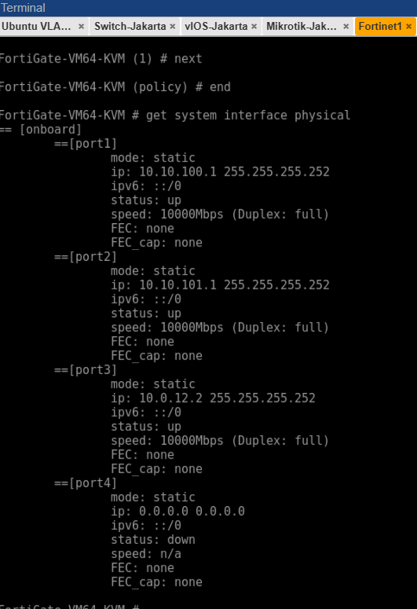

2. Screenshot hasil perintah `get router info routing-table all`.

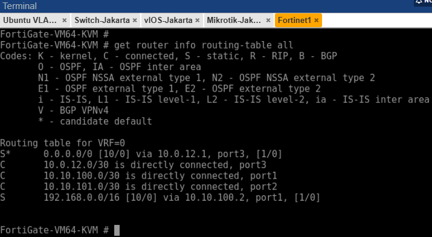

3. Screenshot firewall policy.

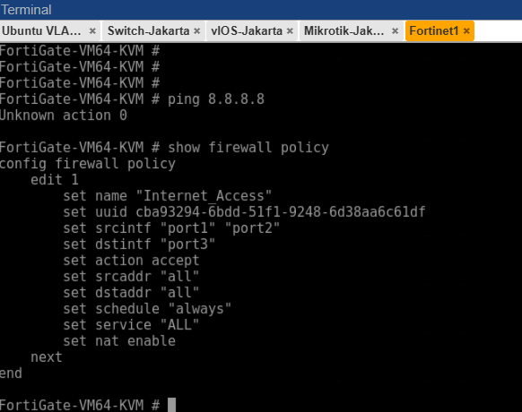

4. Screenshot ping ke 8.8.8.8.

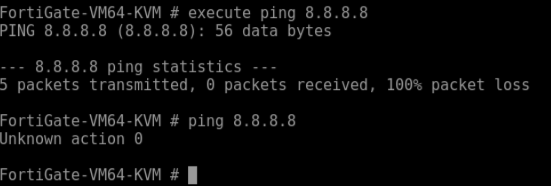

5. Screenshot ping ke IP tunnel Surabaya.

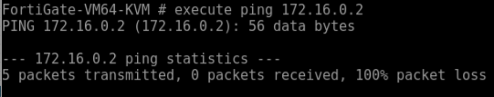

6. Screenshot hasil perintah `get router info ospf neighbor`.

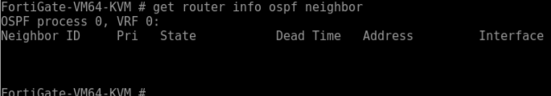

7. Screenshot hasil perintah `get router info routing-table ospf`.

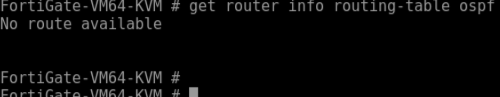

### 6.5 Hasil yang Diharapkan

1. FortiGate Jakarta dapat melakukan ping ke MikroTik ISP.
2. FortiGate Jakarta dapat melakukan ping ke 8.8.8.8.
3. Klien Jakarta dapat mengakses internet.
4. GRE Tunnel menuju Surabaya aktif.
5. OSPF neighbor dengan FortiGate Surabaya berstatus Full.
6. Rute Surabaya muncul pada tabel routing FortiGate Jakarta.

### 6.6 Analisis

FortiGate Jakarta menempati posisi sentral pada topologi karena berfungsi sebagai titik pertemuan antara jaringan internal Jakarta, jalur internet melalui ISP, dan jalur GRE Tunnel menuju Surabaya. Penggunaan static route pada FortiGate untuk menjangkau VLAN 10, VLAN 20, dan VLAN 60 diperlukan karena FortiGate tidak terhubung langsung ke segmen VLAN tersebut, melainkan hanya mengetahui keberadaannya melalui Cisco Router dan MikroTik Router sebagai next-hop.

Firewall policy yang dibuat dengan NAT diaktifkan memungkinkan seluruh klien pada jaringan internal Jakarta yang menggunakan IP privat dapat mengakses internet melalui satu IP publik yang disediakan ISP. Tanpa NAT, paket dari IP privat 192.168.x.x tidak akan dapat dirutekan kembali dari internet karena IP privat tidak valid secara global.

Konfigurasi GRE Tunnel membentuk jalur virtual point-to-point antara FortiGate Jakarta dan FortiGate Surabaya yang melewati jaringan WAN milik ISP. Jalur ini bersifat logis sehingga seolah-olah kedua FortiGate terhubung langsung meskipun secara fisik dipisahkan oleh MikroTik ISP. Penjalanan OSPF di atas antarmuka GRE menjadikan tunnel tersebut sebagai satu segmen jaringan tersendiri dengan area 0.0.0.0, sehingga kedua FortiGate dapat membentuk hubungan neighbor OSPF dan saling mempertukarkan rute secara dinamis. Redistribute static route ke OSPF diperlukan agar rute menuju VLAN 10, VLAN 20, dan VLAN 60 yang sebelumnya hanya berupa static route lokal pada FortiGate Jakarta dapat diiklankan ke FortiGate Surabaya melalui OSPF, sehingga Surabaya dapat mengetahui jalur menuju seluruh network Jakarta tanpa perlu konfigurasi manual tambahan.

---

## 7. Tugas Modul 6: Konfigurasi MikroTik ISP

### 7.1 Perangkat yang Dikonfigurasi

MikroTik ISP.

### 7.2 Tujuan

1. Mengonfigurasi IP link ke FortiGate Jakarta.
2. Mengonfigurasi IP link ke FortiGate Surabaya.
3. Mengonfigurasi koneksi ke Cloud NAT PNETLab.
4. Menambahkan default route menuju Cloud NAT.
5. Mengonfigurasi NAT masquerade agar perangkat pada laboratorium dapat mengakses internet.
6. Memastikan FortiGate Jakarta dan FortiGate Surabaya saling reachable melalui ISP.

### 7.3 Langkah Percobaan

#### Langkah 1: Konfigurasi IP Address Link ke FortiGate Jakarta

```
/ip address add address=10.0.12.1/30 interface=ether2 comment="TO-FORTIGATE-JAKARTA"
```

#### Langkah 2: Konfigurasi IP Address Link ke FortiGate Surabaya

```
/ip address add address=10.0.13.1/30 interface=ether3 comment="TO-FORTIGATE-SURABAYA"
```

#### Langkah 3: Konfigurasi Interface ether1 menuju Cloud NAT PNETLab

Interface ether1 diatur untuk memperoleh IP secara dinamis dari jaringan Cloud NAT yang disediakan PNETLab.

```
/ip dhcp-client add interface=ether1 disabled=no
```

#### Langkah 4: Verifikasi IP Address

```
/ip address print
```

Gambar berikut menunjukkan hasil keluaran perintah `/ip address print` pada MikroTik ISP. Hasil pada ether1 dapat berbeda karena bersifat dinamis.

```
[admin@mikrotik-isp] > ip address print
Flags: X - disabled, I - invalid, D - dynamic 
 #   ADDRESS            NETWORK         INTERFACE                                     
 0 D 10.0.137.149/24    10.0.137.0      ether1                                        
 1   10.0.12.1/30       10.0.12.0       ether2                                        
 2   10.0.13.1/30       10.0.13.0       ether3                                        
[admin@mikrotik-isp] > 
```


#### Langkah 5: Menambahkan Default Route menuju Cloud NAT

Default route diarahkan menuju gateway yang diberikan oleh Cloud NAT pada interface ether1.

```
/ip route add dst-address=0.0.0.0/0 gateway=10.0.137.1
```

#### Langkah 6: Verifikasi Routing Table

```
/ip route print
```

Gambar berikut menunjukkan hasil keluaran perintah `/ip route print` pada MikroTik ISP.

```
[admin@mikrotik-isp] > ip route print
Flags: X - disabled, A - active, D - dynamic, 
C - connect, S - static, r - rip, b - bgp, o - ospf, m - mme, 
B - blackhole, U - unreachable, P - prohibit 
 #      DST-ADDRESS        PREF-SRC        GATEWAY            DISTANCE
 0 ADS  0.0.0.0/0                          10.0.137.1                1
 1 ADC  10.0.12.0/30       10.0.12.1       ether2                    0
 2 ADC  10.0.13.0/30       10.0.13.1       ether3                    0
 3 ADC  10.0.137.0/24      10.0.137.149    ether1                    0
[admin@mikrotik-isp] > 
```


#### Langkah 7: Konfigurasi NAT Masquerade

NAT masquerade diaktifkan pada interface ether1 sehingga seluruh perangkat di laboratorium yang menggunakan IP privat dapat mengakses internet melalui IP dinamis yang diperoleh ether1.

```
/ip firewall nat add chain=srcnat action=masquerade out-interface=ether1
```

#### Langkah 8: Verifikasi Konfigurasi NAT

```
/ip firewall nat print
```

Gambar berikut menunjukkan hasil keluaran perintah `/ip firewall nat print` pada MikroTik ISP.

```
[admin@mikrotik-isp] > ip firewall nat print
Flags: X - disabled, I - invalid, D - dynamic 
 0    chain=srcnat action=masquerade out-interface=ether1 
[admin@mikrotik-isp] > 
```

#### Langkah 9: Pengujian Ping ke Internet

```
/ping 8.8.8.8
```


#### Langkah 10: Pengujian Konektivitas Antar-WAN FortiGate

Lakukan ping dari FortiGate Jakarta menuju IP WAN FortiGate Surabaya, dan sebaliknya, untuk memastikan kedua FortiGate saling reachable melalui MikroTik ISP.

```
execute ping 10.0.13.2
```

Gambar berikut menunjukkan hasil ping antar-WAN FortiGate yang melewati MikroTik ISP.

### 7.4 Bukti Percobaan

1. Screenshot hasil perintah `/ip address print`.

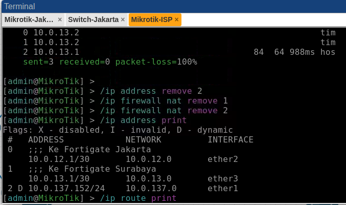

2. Screenshot hasil perintah `/ip route print`.

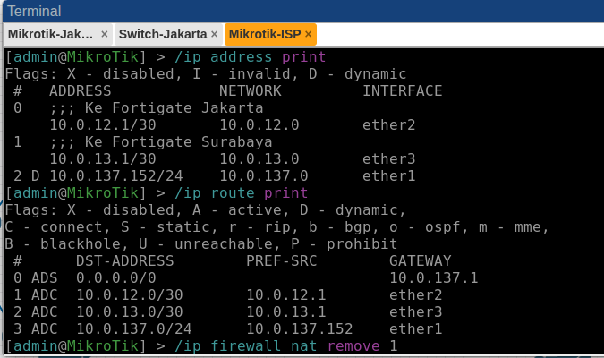

3. Screenshot hasil perintah `/ip firewall nat print`.

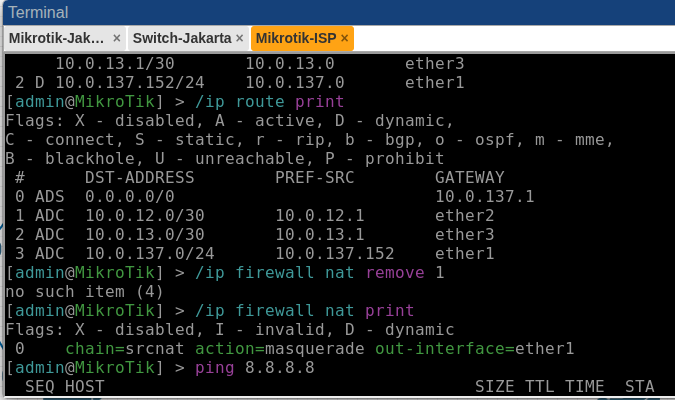

4. Screenshot hasil ping ke 8.8.8.8.

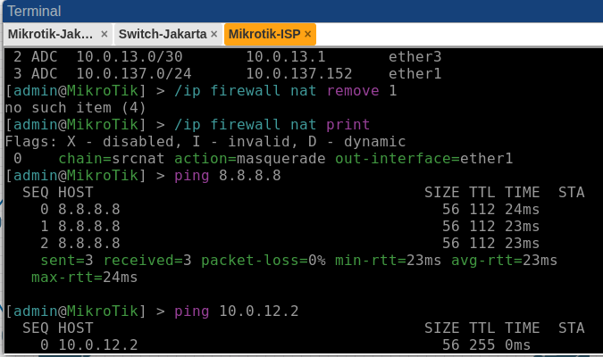

5. Screenshot ping antar-WAN FortiGate.

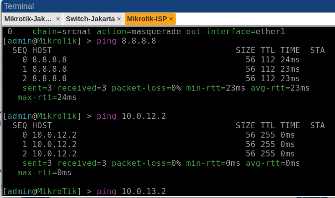
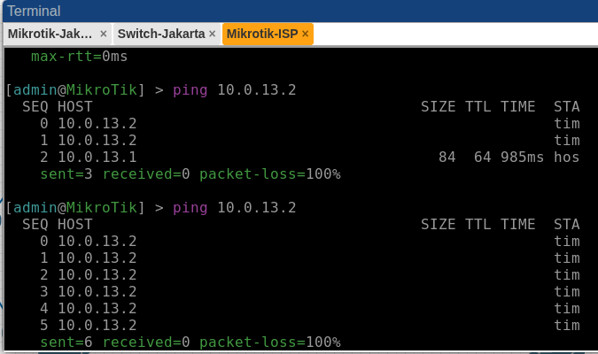

### 7.5 Hasil yang Diharapkan

1. MikroTik ISP dapat melakukan ping ke 8.8.8.8.
2. FortiGate Jakarta dapat melakukan ping ke FortiGate Surabaya melalui IP WAN.
3. FortiGate Surabaya dapat melakukan ping ke FortiGate Jakarta melalui IP WAN.
4. MikroTik ISP tidak menjalankan OSPF enterprise.

### 7.6 Analisis

MikroTik ISP pada topologi ini berperan sebagai simulasi penyedia layanan internet yang menjembatani komunikasi antara FortiGate Jakarta dan FortiGate Surabaya, sekaligus menyediakan akses ke internet publik melalui Cloud NAT PNETLab. Posisi MikroTik ISP bersifat netral terhadap jaringan enterprise, artinya perangkat ini tidak ikut serta dalam proses OSPF yang dijalankan antara FortiGate Jakarta dan FortiGate Surabaya. MikroTik ISP hanya berfungsi sebagai jalur transit pada layer IP murni tanpa mengetahui detail topologi internal kedua kantor.

Konfigurasi NAT masquerade pada interface ether1 menjadi kunci agar seluruh trafik yang berasal dari jaringan privat di laboratorium, termasuk trafik dari FortiGate Jakarta dan FortiGate Surabaya menuju internet publik, dapat diterjemahkan menjadi satu IP publik atau IP dinamis yang valid di sisi Cloud NAT. Tanpa konfigurasi ini, permintaan internet dari klien di Jakarta maupun Surabaya tidak akan memperoleh balasan karena paket balik tidak dapat dirutekan kembali ke alamat IP privat asal.

Pengujian ping antar-WAN FortiGate melalui MikroTik ISP membuktikan bahwa jalur dasar sebelum pembentukan GRE Tunnel telah berfungsi dengan baik. Keberhasilan ping pada level WAN ini menjadi prasyarat mutlak bagi pembentukan GRE Tunnel pada Tugas Modul 9, karena GRE Tunnel dibangun di atas koneksi IP murni antara dua alamat WAN. Apabila konektivitas WAN antar-FortiGate belum terjamin, maka tunnel GRE tidak akan pernah dapat terbentuk meskipun konfigurasinya telah benar.

---

## 8. Tugas Modul 7: Konfigurasi Switch dan MikroTik Surabaya

### 8.1 Perangkat yang Dikonfigurasi

Cisco Switch Surabaya dan MikroTik Router Surabaya.

### 8.2 Tujuan

1. Membuat VLAN 30 dan VLAN 40 pada switch Surabaya.
2. Mengatur port klien VLAN 30 sebagai access port VLAN 30.
3. Mengatur port klien VLAN 40 sebagai access port VLAN 40.
4. Mengatur link switch ke MikroTik Surabaya sebagai trunk.
5. Membuat VLAN interface pada MikroTik Surabaya.
6. Memberikan gateway untuk VLAN 30 dan VLAN 40.
7. Mengonfigurasi DHCP Server lokal pada MikroTik untuk VLAN 30.
8. Menggunakan IP statis untuk klien VLAN 40.
9. Mengonfigurasi link MikroTik Surabaya ke FortiGate Surabaya.
10. Menambahkan default route MikroTik Surabaya menuju FortiGate Surabaya.

### 8.3 Langkah Percobaan

#### Langkah 1: Membuat VLAN 30 dan VLAN 40 pada Cisco Switch Surabaya

```
Switch> enable
Switch# configure terminal

vlan 30
 name SALES
exit

vlan 40
 name OPERATIONS
exit
```

#### Langkah 2: Konfigurasi Access Port untuk VLAN 30 dan VLAN 40

```
interface gi0/1
 description CLIENT-VLAN30-SALES
 switchport mode access
 switchport access vlan 30
 no shutdown
exit

interface gi0/2
 description CLIENT-VLAN40-OPERATIONS
 switchport mode access
 switchport access vlan 40
 no shutdown
exit

interface gi0/3
 description CLIENT-VLAN40-OPERATIONS-TINYCORE
 switchport mode access
 switchport access vlan 40
 no shutdown
exit
```

#### Langkah 3: Konfigurasi Trunk Port ke MikroTik Surabaya

```
interface gi0/0
 switchport trunk encapsulation dot1q
 description TRUNK-TO-MIKROTIK-SURABAYA
 switchport mode trunk
 switchport trunk allowed vlan 30,40
 no shutdown
exit
```

#### Langkah 4: Verifikasi VLAN pada Switch Surabaya

```
show vlan brief
```

Gambar berikut menunjukkan hasil keluaran perintah `show vlan brief` pada Cisco Switch Surabaya.

```
VLAN Name                             Status    Ports
---- -------------------------------- --------- -------------------------------
1    default                          active    Gi1/0, Gi1/1, Gi1/2, Gi1/3
10   VLAN0010                         active    
20   VLAN0020                         active    
30   sales                            active    Gi0/1
40   operations                       active    Gi0/2, Gi0/3
1002 fddi-default                     act/unsup 
1003 token-ring-default               act/unsup 
1004 fddinet-default                  act/unsup 
1005 trnet-default                    act/unsup 
SWITCH-SURABAYA#
```


#### Langkah 5: Verifikasi Trunk Port

```
show interfaces trunk
```

Gambar berikut menunjukkan hasil keluaran perintah `show interfaces trunk` pada Cisco Switch Surabaya.

```
SWITCH-SURABAYA#show interfaces tr

Port        Mode             Encapsulation  Status        Native vlan
Gi0/0       on               802.1q         trunking      1

Port        Vlans allowed on trunk
Gi0/0       30,40

Port        Vlans allowed and active in management domain
Gi0/0       30,40

Port        Vlans in spanning tree forwarding state and not pruned
Gi0/0       30,40
SWITCH-SURABAYA#
```

#### Langkah 6: Menyimpan Konfigurasi Switch

```
write memory
```

#### Langkah 7: Membuat VLAN Interface pada MikroTik Surabaya

```
/interface vlan add name=vlan30-sales vlan-id=30 interface=ether2
/interface vlan add name=vlan40-operations vlan-id=40 interface=ether2
```

#### Langkah 8: Memberikan IP Address sebagai Gateway VLAN 30 dan VLAN 40

```
/ip address add address=192.168.30.1/24 interface=vlan30-sales comment="GATEWAY-VLAN30-SALES"
/ip address add address=192.168.40.1/24 interface=vlan40-operations comment="GATEWAY-VLAN40-OPERATIONS"
```

#### Langkah 9: Konfigurasi Link ke FortiGate Surabaya

```
/ip address add address=10.10.200.2/30 interface=ether1 comment="TO-FORTIGATE-SURABAYA"
```

#### Langkah 10: Verifikasi IP Address MikroTik Surabaya

```
/ip address print
```


```
[admin@mikrotik surabaya] > ip address print
Flags: X - disabled, I - invalid, D - dynamic 
 #   ADDRESS            NETWORK         INTERFACE                              
 0   10.10.200.2/30     10.10.200.0     ether1                                 
 1   192.168.30.1/24    192.168.30.0    vlan30-sales                           
 2   192.168.40.1/24    192.168.40.0    vlan40-operations                      
[admin@mikrotik surabaya] > 
```


#### Langkah 11: Membuat IP Pool untuk DHCP VLAN 30

```
/ip pool add name=dhcp_pool0 ranges=192.168.30.2-192.168.30.254
```

#### Langkah 12: Membuat DHCP Server Lokal untuk VLAN 30

```
/ip dhcp-server add name=dhcp1 interface=vlan30-sales address-pool=dhcp_pool0 lease-time=10m disabled=no
/ip dhcp-server network add address=192.168.30.0/24 gateway=192.168.30.1 dns-server=8.8.8.8
```

#### Langkah 13: Verifikasi DHCP Server dan IP Pool

```
/ip dhcp-server print
/ip pool print
```


```
Flags: D - dynamic, X - disabled, I - invalid 
 #    NAME      INTERFACE    RELAY           ADDRESS-POOL    LEASE-TIME ADD-ARP
 0    dhcp1     vlan30-sales                 dhcp_pool0      10m       
[admin@mikrotik surabaya] > 
```


```
[admin@mikrotik surabaya] > ip pool print
 # NAME                                         RANGES                         
 0 dhcp_pool0                                   192.168.30.2-192.168.30.254    
[admin@mikrotik surabaya] > 
```


#### Langkah 14: Menambahkan Default Route menuju FortiGate Surabaya

```
/ip route add dst-address=0.0.0.0/0 gateway=10.10.200.1
```

#### Langkah 15: Verifikasi Routing Table MikroTik Surabaya

```
/ip route print
```


```
[admin@mikrotik surabaya] > ip route print
Flags: X - disabled, A - active, D - dynamic, 
C - connect, S - static, r - rip, b - bgp, o - ospf, m - mme, 
B - blackhole, U - unreachable, P - prohibit 
 #      DST-ADDRESS        PREF-SRC        GATEWAY            DISTANCE
 0 A S  0.0.0.0/0                          10.10.200.1               1
 1 ADC  10.10.200.0/30     10.10.200.2     ether1                    0
 2 ADC  192.168.30.0/24    192.168.30.1    vlan30-sales              0
 3 ADC  192.168.40.0/24    192.168.40.1    vlan40-operations         0
[admin@mikrotik surabaya] > 
```

#### Langkah 16: Konfigurasi IP Statis pada Klien VLAN 40

Pada PC Operations dan PC Operations Tinycore Linux, atur IP statis sesuai tabel pengalamatan.

```
ip 192.168.40.10/24 192.168.40.1
```

```
ip 192.168.40.20/24 192.168.40.1
```

#### Langkah 17: Pengujian DHCP pada Klien VLAN 30

```
ip dhcp
show ip
```

Gambar berikut menunjukkan hasil pengujian DHCP pada klien VLAN 30.

```
VPCS> ip dhcp
DORA IP 192.168.30.254/24 GW 192.168.30.1

VPCS> show ip

NAME        : VPCS[1]
IP/MASK     : 192.168.30.254/24
GATEWAY     : 192.168.30.1
DNS         : 8.8.8.8  
DHCP SERVER : 192.168.30.1
DHCP LEASE  : 597, 600/300/525
MAC         : 00:50:79:66:68:e7
LPORT       : 20000
RHOST:PORT  : 127.0.0.1:30000
MTU         : 1500

VPCS> 
```

#### Langkah 18: Pengujian Akses Internet dari Klien Surabaya

```
ping 8.8.8.8
```

Gambar berikut menunjukkan hasil ping dari klien Surabaya ke 8.8.8.8.

```
VPCS> ping 8.8.8.8

84 bytes from 8.8.8.8 icmp_seq=1 ttl=109 time=23.941 ms
84 bytes from 8.8.8.8 icmp_seq=2 ttl=109 time=24.313 ms
84 bytes from 8.8.8.8 icmp_seq=3 ttl=109 time=24.125 ms
84 bytes from 8.8.8.8 icmp_seq=4 ttl=109 time=24.357 ms
84 bytes from 8.8.8.8 icmp_seq=5 ttl=109 time=26.724 ms

VPCS> 
```

### 8.4 Bukti Percobaan

1. Screenshot hasil perintah `show vlan brief`.

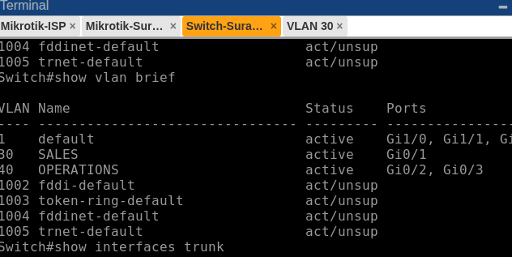

2. Screenshot hasil perintah `show interfaces trunk`.

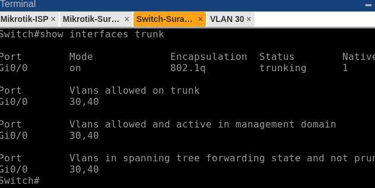

3. Screenshot hasil perintah `/ip address print`.

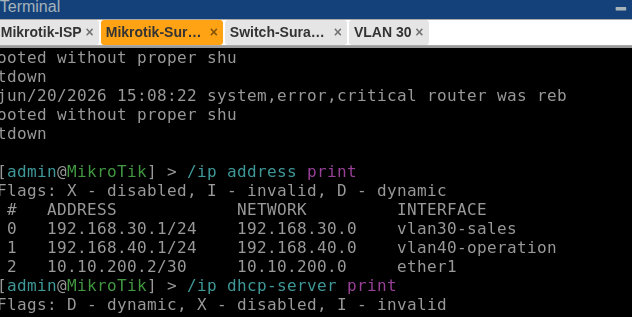

4. Screenshot hasil perintah `/ip dhcp-server print`.

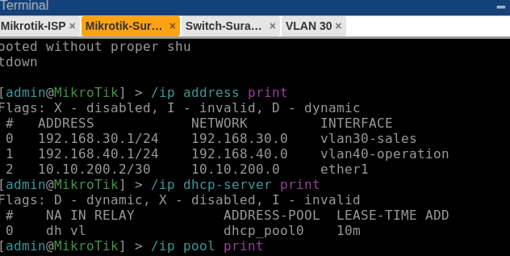

5. Screenshot hasil perintah `/ip pool print`.

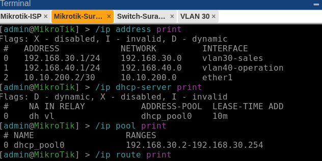

6. Screenshot hasil perintah `/ip route print`.

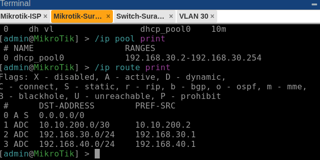

7. Screenshot klien VLAN 30 mendapatkan IP DHCP.

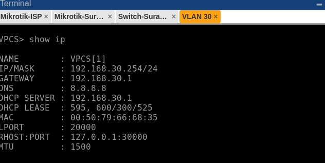

8. Screenshot ping klien Surabaya ke 8.8.8.8.


### 8.5 Hasil yang Diharapkan

1. VLAN 30 dan VLAN 40 aktif pada Switch Surabaya.
2. Klien VLAN 30 mendapatkan IP DHCP dari MikroTik Surabaya.
3. Klien VLAN 40 menggunakan IP statis.
4. Klien VLAN 30 dapat melakukan ping ke gateway.
5. Klien VLAN 40 dapat melakukan ping ke gateway.
6. Klien Surabaya dapat melakukan ping ke 8.8.8.8.

### 8.6 Analisis

Berbeda dengan sisi Jakarta yang menerapkan dual gateway melalui VRRP, sisi Surabaya hanya menggunakan satu gateway tunggal, yaitu MikroTik Router Surabaya, untuk melayani VLAN 30 dan VLAN 40. Pendekatan ini sesuai dengan skala kantor cabang yang lebih kecil dibandingkan kantor pusat, sehingga kompleksitas redundansi gateway tidak diperlukan.

Perbedaan metode pemberian IP antara VLAN 30 dan VLAN 40 mencerminkan dua pendekatan administrasi jaringan yang umum digunakan. VLAN 30 menggunakan DHCP Server lokal pada MikroTik karena jumlah klien pada segmen Sales bersifat dinamis dan sering berganti, sehingga otomatisasi alamat IP lebih efisien. Sebaliknya, VLAN 40 menggunakan IP statis karena perangkat pada segmen Operations, termasuk PC Operations dan PC Operations berbasis Tinycore Linux, bersifat tetap dan memerlukan alamat IP yang konsisten, misalnya untuk keperluan administrasi jarak jauh atau pemetaan layanan tertentu.

Pengaturan DHCP Server langsung pada MikroTik Surabaya, tanpa melalui mekanisme relay seperti pada sisi Jakarta, dimungkinkan karena MikroTik Surabaya sekaligus berperan sebagai gateway VLAN 30, sehingga DHCP Server dapat langsung melayani permintaan klien pada VLAN interface yang sama tanpa perlu meneruskan permintaan ke server lain. Hasil pengujian ping ke 8.8.8.8 yang berhasil pada klien Surabaya membuktikan bahwa jalur lengkap dari klien menuju MikroTik Surabaya, FortiGate Surabaya, MikroTik ISP, hingga Cloud NAT telah berfungsi dengan baik, meskipun pada tahap ini konfigurasi GRE Tunnel dan OSPF belum dilakukan.

---

## 9. Tugas Modul 8: Konfigurasi FortiGate Surabaya

### 9.1 Perangkat yang Dikonfigurasi

FortiGate Surabaya.

### 9.2 Tujuan

1. Mengonfigurasi interface ke MikroTik ISP.
2. Mengonfigurasi interface ke MikroTik Surabaya.
3. Menambahkan default route menuju MikroTik ISP.
4. Menambahkan static route menuju VLAN Surabaya melalui MikroTik Surabaya.
5. Membuat firewall policy dari jaringan Surabaya ke internet.
6. Mengaktifkan NAT untuk trafik internet.
7. Mengonfigurasi GRE Tunnel menuju FortiGate Jakarta.
8. Mengonfigurasi OSPF over GRE.
9. Mengaktifkan redistribute static route ke OSPF.

### 9.3 Langkah Percobaan

#### Langkah 1: Konfigurasi Interface port1 menuju MikroTik ISP

```
config system interface
    edit "port1"
        set mode static
        set ip 10.0.13.2 255.255.255.252
        set allowaccess ping
    next
end
```

#### Langkah 2: Konfigurasi Interface port2 menuju MikroTik Surabaya

```
config system interface
    edit "port2"
        set mode static
        set ip 10.10.200.1 255.255.255.252
        set allowaccess ping
    next
end
```

#### Langkah 3: Verifikasi Status Interface Fisik

```
get system interface physical
```


#### Langkah 4: Menambahkan Default Route menuju MikroTik ISP

```
config router static
    edit 1
        set dst 0.0.0.0 0.0.0.0
        set gateway 10.0.13.1
        set device "port1"
    next
end
```

#### Langkah 5: Menambahkan Static Route menuju VLAN Surabaya melalui MikroTik Surabaya

```
config router static
    edit 2
        set dst 192.168.30.0 255.255.255.0
        set gateway 10.10.200.2
        set device "port2"
    next
    edit 3
        set dst 192.168.40.0 255.255.255.0
        set gateway 10.10.200.2
        set device "port2"
    next
end
```

#### Langkah 6: Verifikasi Routing Table

```
get router info routing-table all
```

Gambar berikut menunjukkan hasil keluaran perintah `get router info routing-table all` pada FortiGate Surabaya.

```
S*      0.0.0.0/0 [10/0] via 10.0.13.1, port1, [1/0]
C       10.0.13.0/30 is directly connected, port1
C       10.10.200.0/30 is directly connected, port2
C       172.16.0.1/32 is directly connected, GRE-SBY-JKT
C       172.16.0.2/32 is directly connected, GRE-SBY-JKT
O E2    192.168.10.0/24 [110/10] via 172.16.0.1, GRE-SBY-JKT, 02:27:36, [1/0]
O E2    192.168.20.0/24 [110/10] via 172.16.0.1, GRE-SBY-JKT, 02:27:36, [1/0]
S       192.168.30.0/24 [10/0] via 10.10.200.2, port2, [1/0]
S       192.168.40.0/24 [10/0] via 10.10.200.2, port2, [1/0]
O E2    192.168.60.0/24 [110/10] via 172.16.0.1, GRE-SBY-JKT, 02:27:36, [1/0]
```


#### Langkah 7: Membuat Address Object untuk Network Internal Surabaya

```
config firewall address
    edit "NET-SURABAYA-ALL"
        set subnet 192.168.30.0 255.255.254.0
    next
end
```

#### Langkah 8: Membuat Firewall Policy dari Jaringan Surabaya menuju Internet

```
config firewall policy
    edit 1
        set name "SURABAYA-TO-INTERNET"
        set srcintf "port2"
        set dstintf "port1"
        set srcaddr "NET-SURABAYA-ALL"
        set dstaddr "all"
        set action accept
        set schedule "always"
        set service "ALL"
        set nat enable
    next
end
```


#### Langkah 9: Pengujian Akses Internet

```
execute ping 8.8.8.8
```

Gambar berikut menunjukkan hasil ping FortiGate Surabaya menuju 8.8.8.8.

```
Fortinet-Surabaya # execute ping 172.16.0.1
PING 172.16.0.1 (172.16.0.1): 56 data bytes
64 bytes from 172.16.0.1: icmp_seq=0 ttl=255 time=1.1 ms
64 bytes from 172.16.0.1: icmp_seq=1 ttl=255 time=1.0 ms
64 bytes from 172.16.0.1: icmp_seq=2 ttl=255 time=0.6 ms
64 bytes from 172.16.0.1: icmp_seq=3 ttl=255 time=0.6 ms
64 bytes from 172.16.0.1: icmp_seq=4 ttl=255 time=0.7 ms

--- 172.16.0.1 ping statistics ---
5 packets transmitted, 5 packets received, 0% packet loss
round-trip min/avg/max = 0.6/0.8/1.1 ms

Fortinet-Surabaya # 
```

#### Langkah 10: Konfigurasi GRE Tunnel menuju FortiGate Jakarta

```
config system gre-tunnel
    edit "GRE-SBY-JKT"
        set interface "port1"
        set remote-gw 10.0.12.2
        set local-gw 10.0.13.2
    next
end
```

#### Langkah 11: Memberikan IP Tunnel pada Interface GRE

```
config system interface
    edit "GRE-SBY-JKT"
        set ip 172.16.0.2 255.255.255.255
        set remote-ip 172.16.0.1 255.255.255.255
        set allowaccess ping
    next
end
```

#### Langkah 12: Konfigurasi OSPF over GRE

```
config router ospf
    set router-id 2.2.2.2
    config area
        edit "0.0.0.0"
        next
    end
    config network
        edit 1
            set prefix 172.16.0.0 255.255.255.252
            set area "0.0.0.0"
        next
    end
end
```

#### Langkah 13: Mengaktifkan Redistribute Static Route ke OSPF

```
config router ospf
    config redistribute "static"
        set status enable
    end
end
```

#### Langkah 14: Verifikasi OSPF Neighbor

```
get router info ospf neighbor
```

Gambar berikut menunjukkan hasil verifikasi neighbor OSPF pada FortiGate Surabaya.

```
Fortinet-Surabaya # get router info ospf neighbor 
OSPF process 0, VRF 0:
Neighbor ID     Pri   State           Dead Time   Address         Interface
1.1.1.1           1   Full/ -         00:00:38    172.16.0.1      GRE-SBY-JKT

Fortinet-Surabaya # 
```


#### Langkah 15: Verifikasi Routing Table OSPF

```
get router info routing-table ospf
```

Gambar berikut menunjukkan rute OSPF yang diterima FortiGate Surabaya dari FortiGate Jakarta.

```
Fortinet-Surabaya # get router info routing-table ospf
Routing table for VRF=0
O E2    192.168.10.0/24 [110/10] via 172.16.0.1, GRE-SBY-JKT, 02:29:23, [1/0]
O E2    192.168.20.0/24 [110/10] via 172.16.0.1, GRE-SBY-JKT, 02:29:23, [1/0]
O E2    192.168.60.0/24 [110/10] via 172.16.0.1, GRE-SBY-JKT, 02:29:23, [1/0]

Fortinet-Surabaya # 
```

### 9.4 Bukti Percobaan

1. Screenshot hasil perintah `get system interface physical`.

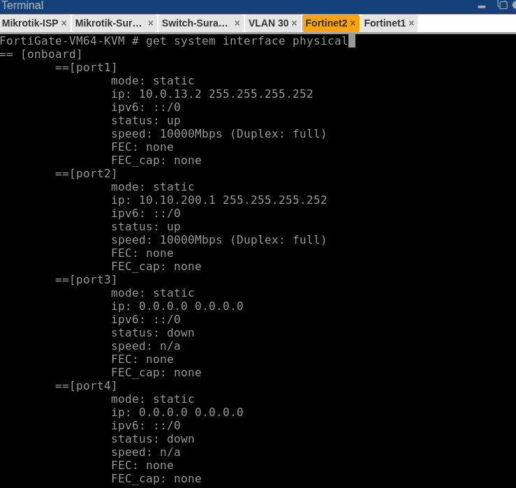

2. Screenshot hasil perintah `get router info routing-table all`.

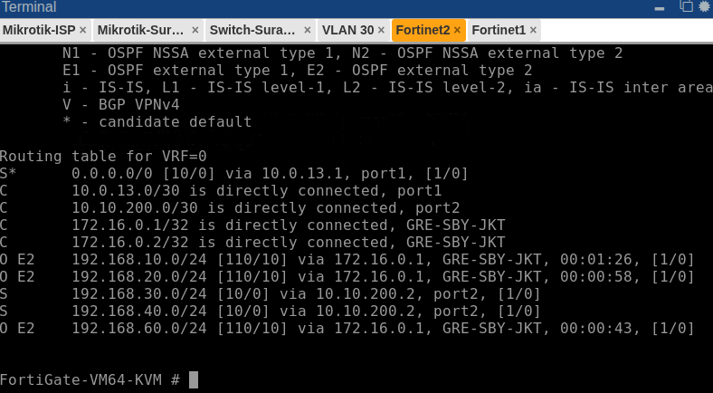

3. Screenshot firewall policy.

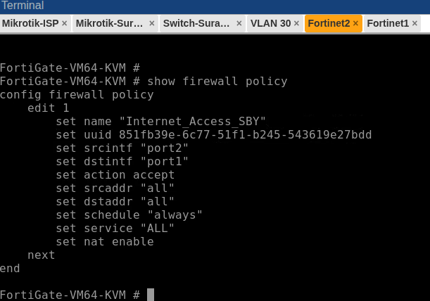

4. Screenshot ping ke 8.8.8.8.

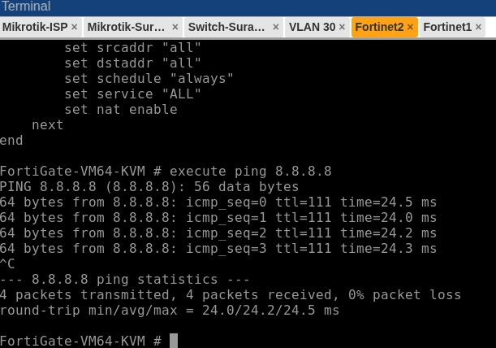

5. Screenshot ping ke IP tunnel Jakarta.

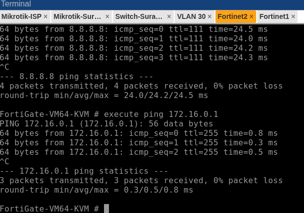

6. Screenshot hasil perintah `get router info ospf neighbor`.

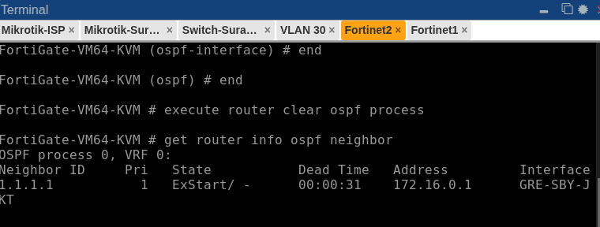

7. Screenshot hasil perintah `get router info routing-table ospf`.

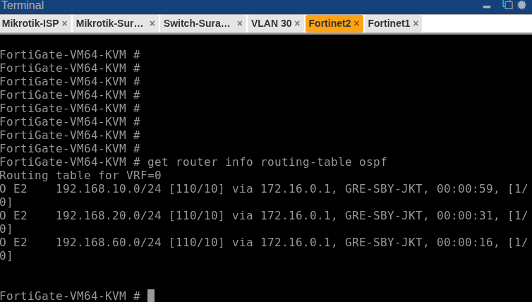

### 9.5 Hasil yang Diharapkan

1. FortiGate Surabaya dapat melakukan ping ke MikroTik ISP.
2. FortiGate Surabaya dapat melakukan ping ke 8.8.8.8.
3. Klien Surabaya dapat mengakses internet.
4. GRE Tunnel menuju Jakarta aktif.
5. OSPF neighbor dengan FortiGate Jakarta berstatus Full.
6. Rute Jakarta muncul pada tabel routing FortiGate Surabaya.

### 9.6 Analisis

Konfigurasi pada FortiGate Surabaya secara struktural serupa dengan FortiGate Jakarta, namun dengan jumlah static route yang lebih sedikit karena hanya melayani dua VLAN, yaitu VLAN 30 dan VLAN 40, dibandingkan tiga VLAN pada sisi Jakarta. Static route menuju VLAN 30 dan VLAN 40 diarahkan ke MikroTik Surabaya sebagai next-hop karena FortiGate tidak terhubung langsung ke segmen VLAN tersebut.

Hasil verifikasi routing table all pada FortiGate Surabaya menunjukkan kombinasi tiga jenis rute, yaitu rute static menuju VLAN 30 dan VLAN 40 yang ditandai dengan kode S, rute connected pada interface fisik dan interface GRE yang ditandai dengan kode C, serta rute OSPF eksternal tipe 2 yang ditandai dengan kode O E2 menuju VLAN 10, VLAN 20, dan VLAN 60 di Jakarta. Notasi E2 menandakan bahwa rute tersebut berasal dari proses redistribusi static route ke OSPF, bukan dari OSPF native, sehingga metric yang ditampilkan tetap mengikuti nilai cost asal tanpa akumulasi cost sepanjang jalur OSPF.

Keberhasilan OSPF neighbor antara FortiGate Surabaya dengan router ID 2.2.2.2 dan FortiGate Jakarta dengan router ID 1.1.1.1 yang mencapai status Full menandakan bahwa kedua FortiGate telah berhasil saling bertukar Link State Database secara lengkap melalui antarmuka GRE-SBY-JKT. Status Full merupakan tahap akhir dalam proses pembentukan adjacency OSPF, yang berarti kedua router telah memiliki gambaran topologi yang identik dan siap menggunakan jalur tersebut untuk meneruskan trafik antar-site.

---

## 10. Tugas Modul 9: Konfigurasi GRE Tunnel dan OSPF over GRE

### 10.1 Perangkat yang Dikonfigurasi

FortiGate Jakarta dan FortiGate Surabaya.

### 10.2 Tujuan

1. Membuat GRE Tunnel antara FortiGate Jakarta dan FortiGate Surabaya.
2. Memberikan IP tunnel pada masing-masing FortiGate.
3. Memastikan IP WAN kedua FortiGate saling reachable.
4. Menguji tunnel menggunakan ping antar-IP tunnel.
5. Menjalankan OSPF di atas GRE Tunnel.
6. Mengaktifkan redistribute static route ke OSPF.
7. Memastikan rute antar-site muncul sebagai rute OSPF.

Catatan: konfigurasi GRE Tunnel dan OSPF over GRE pada masing-masing FortiGate telah dijelaskan langkahnya secara rinci pada Tugas Modul 5 untuk sisi Jakarta dan Tugas Modul 8 untuk sisi Surabaya. Bagian ini menjelaskan langkah verifikasi menyeluruh untuk memastikan tunnel dan OSPF berfungsi sebagai satu kesatuan sistem.

### 10.3 Langkah Percobaan

#### Langkah 1: Verifikasi Konektivitas WAN Antar-FortiGate

Sebelum memeriksa tunnel, pastikan terlebih dahulu bahwa IP WAN kedua FortiGate dapat saling melakukan ping melalui MikroTik ISP.

Dari FortiGate Jakarta:
```
execute ping 10.0.13.2
```

Dari FortiGate Surabaya:
```
execute ping 10.0.12.2
```


#### Langkah 2: Verifikasi Status Tunnel GRE

Periksa status interface GRE pada kedua FortiGate untuk memastikan tunnel berstatus up.

```
get system interface physical
```

Amati status interface `GRE-JKT-SBY` pada FortiGate Jakarta dan `GRE-SBY-JKT` pada FortiGate Surabaya.

#### Langkah 3: Pengujian Ping Antar-IP Tunnel

Dari FortiGate Surabaya, lakukan ping menuju IP tunnel FortiGate Jakarta.

```
execute ping 172.16.0.1
```

Gambar berikut menunjukkan hasil ping tunnel antar-FortiGate.

```
Fortinet-Surabaya # execute ping 172.16.0.1
PING 172.16.0.1 (172.16.0.1): 56 data bytes
64 bytes from 172.16.0.1: icmp_seq=0 ttl=255 time=0.7 ms
64 bytes from 172.16.0.1: icmp_seq=1 ttl=255 time=0.6 ms
64 bytes from 172.16.0.1: icmp_seq=2 ttl=255 time=0.7 ms
^C
--- 172.16.0.1 ping statistics ---
3 packets transmitted, 3 packets received, 0% packet loss
round-trip min/avg/max = 0.6/0.6/0.7 ms

Fortinet-Surabaya # 
```

#### Langkah 4: Verifikasi OSPF Neighbor pada Kedua FortiGate

Pada FortiGate Jakarta:
```
get router info ospf neighbor
```

Pada FortiGate Surabaya:
```
get router info ospf neighbor
```

Pastikan kedua sisi menunjukkan status Full terhadap router ID pasangannya.


#### Langkah 5: Verifikasi Routing Table OSPF pada Kedua FortiGate

Pada FortiGate Jakarta:
```
get router info routing-table ospf
```

Pada FortiGate Surabaya:
```
get router info routing-table ospf
```

Pastikan FortiGate Jakarta menerima rute VLAN 30 dan VLAN 40 milik Surabaya, dan FortiGate Surabaya menerima rute VLAN 10, VLAN 20, dan VLAN 60 milik Jakarta.


#### Langkah 6: Pengujian Ping Antar-Klien Jakarta dan Surabaya

Dari klien Jakarta, lakukan ping menuju klien Surabaya.

```
ping 192.168.30.10
```


Dari klien Surabaya, lakukan ping menuju klien Jakarta.

```
ping 192.168.10.100
```


### 10.4 Bukti Percobaan

1. Screenshot ping WAN antar-FortiGate.


2. Screenshot ping tunnel antar-FortiGate.

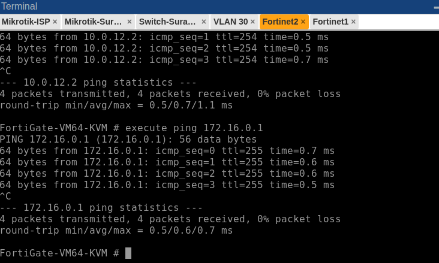

3. Screenshot hasil perintah `get router info ospf neighbor` pada kedua FortiGate.

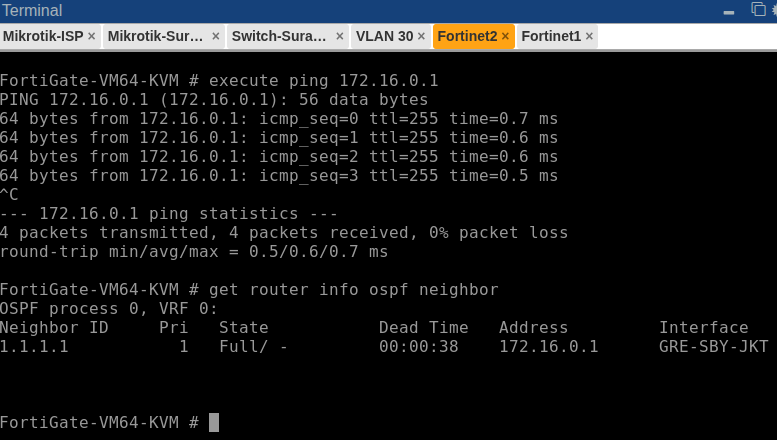

4. Screenshot hasil perintah `get router info routing-table ospf` pada kedua FortiGate.

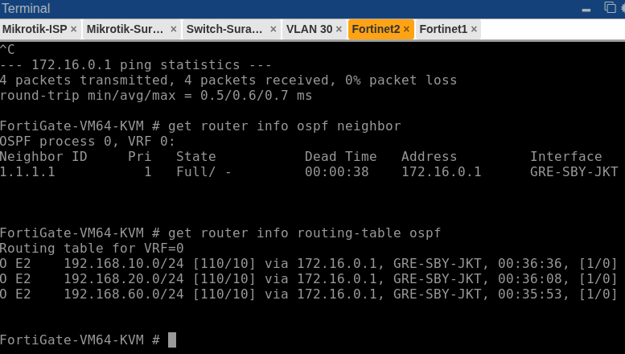

5. Screenshot ping klien Jakarta ke klien Surabaya.

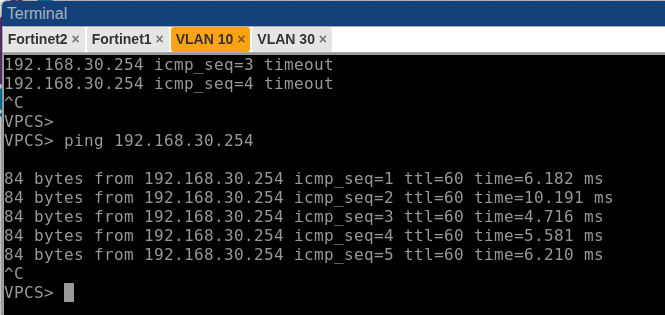

6. Screenshot ping klien Surabaya ke klien Jakarta.

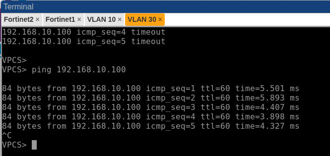

### 10.5 Hasil yang Diharapkan

1. FortiGate Jakarta dapat melakukan ping ke IP tunnel FortiGate Surabaya.
2. FortiGate Surabaya dapat melakukan ping ke IP tunnel FortiGate Jakarta.
3. OSPF neighbor antar-FortiGate berstatus Full.
4. FortiGate Jakarta menerima rute VLAN Surabaya.
5. FortiGate Surabaya menerima rute VLAN Jakarta.
6. Klien Jakarta dan klien Surabaya dapat saling melakukan ping.

### 10.6 Analisis

Tugas Modul 9 berfungsi sebagai tahap integrasi yang menggabungkan seluruh konfigurasi GRE Tunnel dan OSPF yang telah dimulai secara terpisah pada Tugas Modul 5 dan Tugas Modul 8. Pada tahap ini, pengujian difokuskan pada pembuktian bahwa tunnel dan protokol routing dapat bekerja bersama sebagai satu jalur komunikasi yang utuh antara dua site yang terpisah secara geografis dalam simulasi.

Urutan pengujian yang dimulai dari ping WAN, kemudian ping tunnel, dilanjutkan dengan verifikasi OSPF neighbor, dan diakhiri dengan ping antar-klien, mencerminkan pendekatan troubleshooting berlapis dari layer bawah ke layer atas. Ping WAN membuktikan konektivitas IP dasar pada layer 3 murni tanpa enkapsulasi tambahan. Ping tunnel membuktikan bahwa enkapsulasi GRE berhasil dibentuk dan paket dapat melewati tunnel virtual tersebut. Verifikasi OSPF neighbor membuktikan bahwa protokol routing dinamis berhasil membentuk adjacency di atas tunnel. Ping antar-klien pada langkah terakhir membuktikan bahwa seluruh rangkaian, mulai dari VRRP atau gateway lokal, FortiGate, GRE Tunnel, hingga OSPF, berfungsi sebagai satu kesatuan jalur end-to-end.

Keberhasilan ping antar-klien Jakarta dan Surabaya menjadi indikator paling meyakinkan bahwa desain jaringan enterprise HQ-Branch telah berjalan sesuai rancangan, karena ping tersebut secara implisit melewati seluruh komponen kritis pada topologi, yaitu access port pada switch, gateway VLAN, static route atau VRRP, firewall policy pada FortiGate, GRE Tunnel, dan OSPF over GRE secara bersamaan. Apabila terdapat satu komponen yang gagal dikonfigurasi dengan benar, maka ping end-to-end ini tidak akan berhasil, sehingga pengujian ini berfungsi sebagai validasi akhir sebelum masuk ke Tugas Modul 10.

---

## 11. Tugas Modul 10: Pengujian Akhir Sistem

### 11.1 Perangkat yang Diuji

Seluruh perangkat pada topologi jaringan enterprise HQ-Branch.

### 11.2 Tujuan

1. Memastikan klien VLAN 10 Jakarta mendapatkan IP DHCP dari Ubuntu Server.
2. Memastikan klien VLAN 20 Jakarta mendapatkan IP DHCP dari Ubuntu Server.
3. Memastikan klien VLAN 30 Surabaya mendapatkan IP DHCP dari MikroTik Surabaya.
4. Memastikan klien VLAN 40 Surabaya menggunakan IP statis dengan benar.
5. Memastikan klien Jakarta dapat melakukan ping ke 8.8.8.8.
6. Memastikan klien Surabaya dapat melakukan ping ke 8.8.8.8.
7. Memastikan klien Jakarta dapat melakukan ping ke klien Surabaya.
8. Memastikan klien Surabaya dapat melakukan ping ke klien Jakarta.
9. Memastikan klien Surabaya dapat mengakses web server Jakarta.

### 11.3 Langkah Percobaan

#### Langkah 1: Pengujian DHCP pada Klien VLAN 10 Jakarta

Masuk ke VPCS pada VLAN 10, kemudian minta IP secara DHCP.

```
ip dhcp
```

Gambar berikut menunjukkan hasil perolehan IP DHCP pada klien VLAN 10 Jakarta.

```
VPCS> ip dhcp
DDORA IP 192.168.10.105/24 GW 192.168.10.1

VPCS> 
```


#### Langkah 2: Pengujian DHCP pada Klien VLAN 20 Jakarta

Masuk ke VPCS pada VLAN 20, kemudian minta IP secara DHCP.

```
ip dhcp
show ip
```

Pastikan klien memperoleh IP pada rentang 192.168.20.100 hingga 192.168.20.200 dengan gateway 192.168.20.1.

#### Langkah 3: Pengujian DHCP pada Klien VLAN 30 Surabaya

Masuk ke VPCS pada VLAN 30, kemudian minta IP secara DHCP.

```
ip dhcp
```

Gambar berikut menunjukkan hasil perolehan IP DHCP pada klien VLAN 30 Surabaya.

```
VPCS> ip dhcp
DORA IP 192.168.30.254/24 GW 192.168.30.1

VPCS> 
```


#### Langkah 4: Verifikasi IP Statis pada Klien VLAN 40 Surabaya

Pada PC Operations dan PC Operations Tinycore Linux, pastikan IP statis sudah terpasang sesuai konfigurasi pada Tugas Modul 7.

```
show ip
```

#### Langkah 5: Pengujian Akses Internet dari Klien Jakarta

```
ping 8.8.8.8
```

Gambar berikut menunjukkan hasil ping klien Jakarta menuju 8.8.8.8.

```
VPCS> ping 8.8.8.8

84 bytes from 8.8.8.8 icmp_seq=1 ttl=109 time=26.281 ms
84 bytes from 8.8.8.8 icmp_seq=2 ttl=109 time=23.619 ms
84 bytes from 8.8.8.8 icmp_seq=3 ttl=109 time=24.492 ms
84 bytes from 8.8.8.8 icmp_seq=4 ttl=109 time=24.778 ms
^C
VPCS> 
```


#### Langkah 6: Pengujian Akses Internet dari Klien Surabaya

```
ping 8.8.8.8
```

Gambar berikut menunjukkan hasil ping klien Surabaya menuju 8.8.8.8.

```
VPCS> ping 8.8.8.8

84 bytes from 8.8.8.8 icmp_seq=1 ttl=109 time=26.281 ms
84 bytes from 8.8.8.8 icmp_seq=2 ttl=109 time=23.619 ms
84 bytes from 8.8.8.8 icmp_seq=3 ttl=109 time=24.492 ms
84 bytes from 8.8.8.8 icmp_seq=4 ttl=109 time=24.778 ms
^C
VPCS> 
```


#### Langkah 7: Pengujian Ping Antar-Site

Lakukan pengujian ping antar-VLAN dari salah satu site ke site lainnya. Sebagai contoh, dari klien VLAN 10 Jakarta menuju klien VLAN 40 Surabaya.

```
ping 192.168.40.10
```

Gambar berikut menunjukkan hasil ping antar-site.

```
VPCS> ping 192.168.40.10

84 bytes from 192.168.40.10 icmp_seq=1 ttl=63 time=9.169 ms
84 bytes from 192.168.40.10 icmp_seq=2 ttl=63 time=2.201 ms
84 bytes from 192.168.40.10 icmp_seq=3 ttl=63 time=30.848 ms
84 bytes from 192.168.40.10 icmp_seq=4 ttl=63 time=2.724 ms
^C
VPCS> 
```


#### Langkah 8: Pengujian Akses Web Server Jakarta dari Surabaya

Pada klien Surabaya, buka browser atau gunakan perintah curl untuk mengakses IP web server Jakarta pada VLAN 60.

```
curl http://192.168.60.10
```


#### Langkah 9: Verifikasi Routing Table OSPF Secara Menyeluruh

Lakukan pemeriksaan akhir pada tabel routing OSPF di FortiGate Jakarta dan FortiGate Surabaya untuk memastikan seluruh rute antar-site telah tersebar dengan benar.

```
get router info routing-table ospf
```


#### Langkah 10: Analisis Jalur Trafik Jakarta ke Surabaya

Lakukan traceroute dari klien Jakarta menuju klien Surabaya untuk memetakan jalur yang dilalui paket data.

```
trace 192.168.30.10
```

Amati hasil traceroute untuk memastikan paket melewati urutan perangkat yang sesuai dengan rancangan topologi, yaitu gateway VRRP Jakarta, FortiGate Jakarta, GRE Tunnel, FortiGate Surabaya, MikroTik Surabaya, hingga akhirnya sampai ke klien tujuan.


### 11.4 Bukti Percobaan

1. Screenshot IP DHCP klien Jakarta VLAN 10.

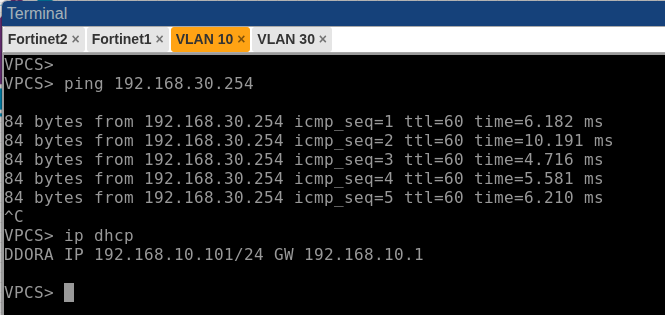

2. Screenshot IP DHCP klien Surabaya VLAN 30.

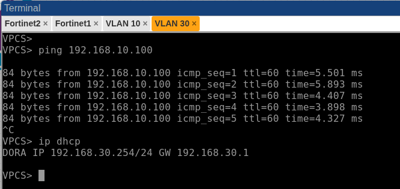

3. Screenshot ping internet dari Jakarta.

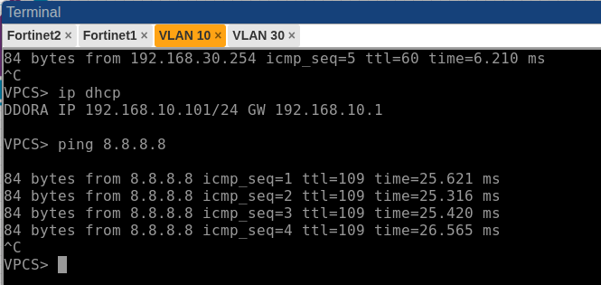

4. Screenshot ping internet dari Surabaya.

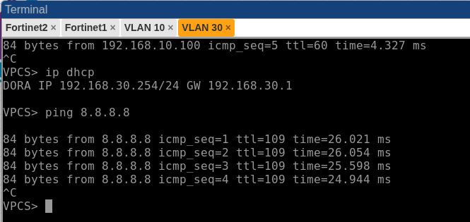

5. Screenshot ping antar-site.

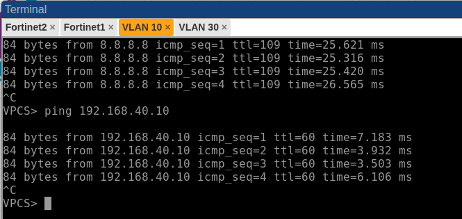

6. Screenshot akses web server Jakarta dari Surabaya.


7. Screenshot routing table OSPF.

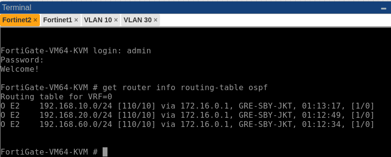

8. Screenshot traceroute Jakarta ke Surabaya.


### 11.5 Hasil yang Diharapkan

1. Seluruh klien memperoleh konfigurasi IP sesuai ketentuan, baik melalui DHCP maupun statis.
2. Akses internet berjalan dengan baik pada sisi Jakarta dan sisi Surabaya.
3. GRE Tunnel aktif dan stabil.
4. OSPF over GRE berhasil membentuk neighbor dengan status Full.
5. Rute antar-site tersebar dengan benar melalui OSPF.
6. Web server Jakarta dapat diakses dari Surabaya.
7. Mekanisme failover gateway Jakarta berjalan menggunakan VRRP.

### 11.6 Analisis

Tugas Modul 10 merupakan tahap pengujian akhir yang menyatukan seluruh hasil konfigurasi dari Tugas Modul 1 hingga Tugas Modul 9 ke dalam satu rangkaian pengujian fungsional secara menyeluruh. Pengujian dimulai dari layer akses, yaitu memastikan setiap klien memperoleh konfigurasi IP yang sesuai dengan metode yang telah ditentukan pada masing-masing VLAN, baik melalui DHCP terpusat di Jakarta, DHCP lokal di Surabaya, maupun IP statis pada VLAN 40.

Pengujian akses internet dari kedua site membuktikan bahwa jalur NAT pada FortiGate Jakarta dan FortiGate Surabaya, yang diteruskan melalui MikroTik ISP menuju Cloud NAT, berfungsi dengan baik secara independen pada masing-masing site. Selanjutnya, pengujian ping antar-site dan akses web server Jakarta dari Surabaya membuktikan bahwa jalur GRE Tunnel beserta OSPF yang berjalan di atasnya berhasil menyatukan dua jaringan yang secara fisik terpisah menjadi satu kesatuan logis yang dapat saling berkomunikasi.

Analisis jalur trafik melalui traceroute dari Jakarta ke Surabaya menunjukkan bahwa paket data melewati urutan perangkat yang konsisten dengan rancangan awal topologi, yaitu dimulai dari gateway VRRP di sisi Jakarta, diteruskan ke FortiGate Jakarta, masuk ke dalam GRE Tunnel menuju FortiGate Surabaya, kemudian diteruskan oleh MikroTik Surabaya hingga mencapai klien tujuan. Konsistensi jalur ini membuktikan bahwa OSPF berhasil memilih rute yang optimal berdasarkan informasi link-state yang telah dipertukarkan antara kedua FortiGate, tanpa terjadi routing loop maupun jalur yang tidak efisien.

Secara keseluruhan, keberhasilan seluruh pengujian pada Tugas Modul 10 menandakan bahwa implementasi jaringan enterprise HQ-Branch dengan kombinasi VRRP, ISC-DHCP, FortiGate, GRE Tunnel, dan OSPF telah berhasil memenuhi seluruh tujuan rancangan, yaitu menyediakan konektivitas yang andal, redundan pada sisi gateway Jakarta, serta terintegrasi secara dinamis antara kantor pusat dan kantor cabang melalui jalur tunnel yang aman dan efisien.

---

## 12. Kesimpulan Umum

Implementasi jaringan enterprise HQ-Branch yang dibahas pada Tugas Modul 1 sampai Tugas Modul 10 menggabungkan berbagai teknologi jaringan, mulai dari segmentasi VLAN, redundansi gateway menggunakan VRRP, layanan DHCP terpusat maupun lokal, firewall dan NAT menggunakan FortiGate, hingga interkoneksi antar-site menggunakan GRE Tunnel dengan routing dinamis OSPF.

Pendekatan bertahap yang diterapkan pada setiap tugas modul, dimulai dari konfigurasi perangkat akses seperti switch, kemudian perangkat distribusi seperti router dan gateway, dan diakhiri dengan perangkat keamanan serta interkoneksi seperti FortiGate, memungkinkan proses konfigurasi dilakukan secara sistematis dan memudahkan identifikasi masalah apabila terjadi kegagalan pada salah satu tahap. Setiap tugas modul juga saling bergantung satu sama lain, sehingga keberhasilan pada tugas modul sebelumnya menjadi prasyarat bagi keberhasilan tugas modul selanjutnya.

Hasil pengujian akhir pada Tugas Modul 10 menunjukkan bahwa seluruh komponen jaringan, baik pada sisi Jakarta maupun sisi Surabaya, telah terintegrasi dengan baik dan mampu menyediakan konektivitas penuh antara klien pada kedua site, akses internet yang stabil, serta mekanisme redundansi gateway yang berfungsi sesuai dengan rancangan. Dengan demikian, tujuan utama praktikum untuk membangun simulasi jaringan enterprise yang realistis dan dapat diandalkan telah tercapai.
