# Laporan Tugas Modul 5

## Daftar Isi

1. [Topologi Jaringan](#1-topologi-jaringan)
2. [Tabel IP Address](#2-tabel-ip-address)
3. [Konfigurasi Tiap Perangkat](#3-konfigurasi-tiap-perangkat)
   - [3.1 MikroTik ISP](#31-mikrotik-isp)
   - [3.2 Ubuntu Server Jakarta](#32-ubuntu-server-jakarta)
   - [3.3 FortiGate Jakarta](#33-fortigate-jakarta)
   - [3.4 FortiGate Surabaya](#34-fortigate-surabaya)
   - [3.5 MikroTik Router Surabaya](#35-mikrotik-router-surabaya)
4. [Hasil Pengujian](#4-hasil-pengujian)
   - [4.1 DHCP Client Jakarta (VLAN 10 & 20)](#41-dhcp-client-jakarta-vlan-10--20)
   - [4.2 DHCP Client Surabaya (VLAN 30) & Static VLAN 40](#42-dhcp-client-surabaya-vlan-30--static-vlan-40)
   - [4.3 Akses Internet dari Jakarta dan Surabaya](#43-akses-internet-dari-jakarta-dan-surabaya)
   - [4.4 GRE Tunnel antar-FortiGate](#44-gre-tunnel-antar-fortigate)
   - [4.5 OSPF over GRE](#45-ospf-over-gre)
   - [4.6 Ping antar-Site Jakarta–Surabaya](#46-ping-antar-site-jakartasurabaya)
   - [4.7 Akses Web Server Jakarta dari Surabaya](#47-akses-web-server-jakarta-dari-surabaya)
5. [Analisis](#5-analisis)
6. [Kesimpulan](#6-kesimpulan)

---

## 1. Topologi Jaringan

Simulasi dibangun di atas platform **PNETLab** yang mensimulasikan jaringan enterprise dengan dua lokasi: **HQ Jakarta** dan **Branch Surabaya**, yang saling terhubung melalui **GRE Tunnel** di atas jaringan ISP.

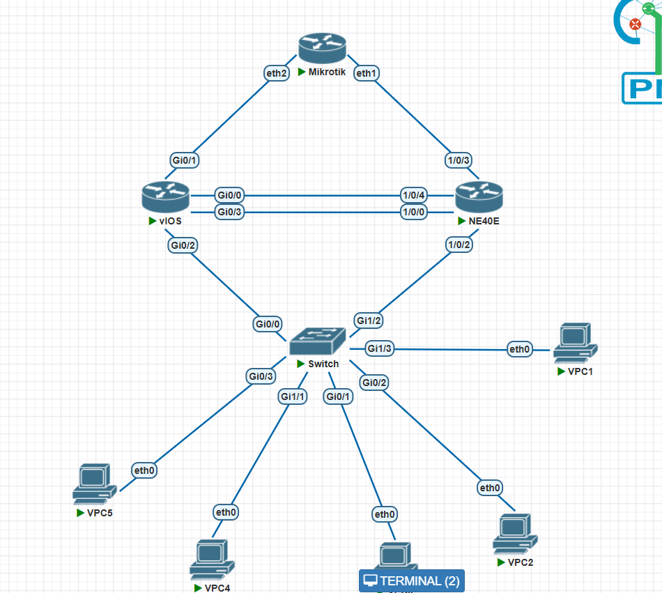

> *Topologi jaringan enterprise menghubungkan HQ Jakarta dan Branch Surabaya melalui GRE Tunnel. Sisi Jakarta menggunakan dual gateway Cisco Router dan MikroTik Router dengan VRRP. Ubuntu Server Jakarta menjalankan ISC-DHCP Server terpusat untuk VLAN 10 dan 20. FortiGate di kedua sisi berfungsi sebagai edge firewall sekaligus GRE endpoint.*

---

## 2. Tabel IP Address

### Sisi Jakarta / HQ

| Perangkat             | Interface        | IP Address       | Keterangan                             |
|-----------------------|------------------|------------------|----------------------------------------|
| Cisco Router Jakarta  | Gi0/1.10         | 192.168.10.2/24  | IP fisik subinterface VLAN 10          |
| Cisco Router Jakarta  | Gi0/1.20         | 192.168.20.2/24  | IP fisik subinterface VLAN 20          |
| Cisco Router Jakarta  | Gi0/1.60         | 192.168.60.2/24  | IP fisik subinterface VLAN 60          |
| Cisco Router Jakarta  | Gi0/0            | 10.10.100.2/30   | Link ke FortiGate Jakarta (port1)      |
| MikroTik Jakarta      | vlan10-finance   | 192.168.10.3/24  | IP fisik VLAN 10                       |
| MikroTik Jakarta      | vlan20-it        | 192.168.20.3/24  | IP fisik VLAN 20                       |
| MikroTik Jakarta      | vlan60-server    | 192.168.60.3/24  | IP fisik VLAN 60                       |
| MikroTik Jakarta      | ether1           | 10.10.101.2/30   | Link ke FortiGate Jakarta (port2)      |
| VRRP Jakarta          | vrrp10           | 192.168.10.1/32  | Virtual IP VLAN 10 (Master: Cisco)     |
| VRRP Jakarta          | vrrp20           | 192.168.20.1/32  | Virtual IP VLAN 20 (Master: MikroTik)  |
| VRRP Jakarta          | vrrp60           | 192.168.60.1/32  | Virtual IP VLAN 60 (Master: Cisco)     |
| FortiGate Jakarta     | port1            | 10.10.100.1/30   | Link ke Cisco Router Jakarta           |
| FortiGate Jakarta     | port2            | 10.10.101.1/30   | Link ke MikroTik Router Jakarta        |
| FortiGate Jakarta     | port3            | 10.0.12.2/30     | Link WAN ke MikroTik ISP               |
| FortiGate Jakarta     | GRE-JKT-SBY      | 172.16.0.1/32    | IP tunnel GRE ke Surabaya              |
| Ubuntu Server Jakarta | eth0             | 192.168.60.10/24 | ISC-DHCP Server dan Nginx Web Server   |

### Sisi ISP

| Perangkat      | Interface | IP Address        | Keterangan                  |
|----------------|-----------|-------------------|-----------------------------|
| MikroTik ISP   | ether1    | DHCP (dinamis)    | Koneksi ke Cloud/Internet   |
| MikroTik ISP   | ether2    | 10.0.12.1/30      | Link ISP ke FortiGate JKT   |
| MikroTik ISP   | ether3    | 10.0.13.1/30      | Link ISP ke FortiGate SBY   |

### Sisi Surabaya / Branch

| Perangkat              | Interface          | IP Address        | Keterangan                           |
|------------------------|--------------------|-------------------|--------------------------------------|
| FortiGate Surabaya     | port1              | 10.0.13.2/30      | Link WAN ke MikroTik ISP             |
| FortiGate Surabaya     | port2              | 10.10.200.1/30    | Link ke MikroTik Surabaya            |
| FortiGate Surabaya     | GRE-SBY-JKT        | 172.16.0.2/32     | IP tunnel GRE ke Jakarta             |
| MikroTik Surabaya      | ether1             | 10.10.200.2/30    | Link ke FortiGate Surabaya           |
| MikroTik Surabaya      | vlan30-sales       | 192.168.30.1/24   | Gateway VLAN 30 (DHCP)               |
| MikroTik Surabaya      | vlan40-operations  | 192.168.40.1/24   | Gateway VLAN 40 (static)             |
| PC Sales (VLAN 30)     | eth0               | DHCP              | Dapat IP dari MikroTik Surabaya      |
| PC Operations (VLAN 40)| eth0               | 192.168.40.10/24  | IP static manual                     |
| PC Operations (VLAN 40)| eth0               | 192.168.40.20/24  | IP static manual (TinyCore)          |

---

## 3. Konfigurasi Tiap Perangkat

### 3.1 MikroTik ISP

MikroTik ISP mensimulasikan jaringan provider yang menghubungkan FortiGate Jakarta dan FortiGate Surabaya, sekaligus memberikan akses internet ke seluruh simulasi melalui NAT masquerade ke Cloud PNETLab.

**IP Address:**
```
/ip address print
Flags: X - disabled, I - invalid, D - dynamic
 #   ADDRESS            NETWORK         INTERFACE
 0 D 10.0.137.149/24    10.0.137.0      ether1     ← DHCP dari Cloud (IP bisa berbeda)
 1   10.0.12.1/30       10.0.12.0       ether2     ← Link ke FortiGate Jakarta
 2   10.0.13.1/30       10.0.13.0       ether3     ← Link ke FortiGate Surabaya
```

**Routing Table:**
```
/ip route print
 #      DST-ADDRESS        PREF-SRC        GATEWAY            DISTANCE
 0 ADS  0.0.0.0/0                          10.0.137.1                1
 1 ADC  10.0.12.0/30       10.0.12.1       ether2                    0
 2 ADC  10.0.13.0/30       10.0.13.1       ether3                    0
 3 ADC  10.0.137.0/24      10.0.137.149    ether1                    0
```

**NAT Masquerade:**
```
/ip firewall nat print
 0  chain=srcnat  action=masquerade  out-interface=ether1
```

> *MikroTik ISP tidak menjalankan OSPF enterprise. Seluruh routing antar-site ditangani oleh GRE Tunnel dan OSPF di sisi FortiGate.*

---

### 3.2 Ubuntu Server Jakarta

Ubuntu Server Jakarta menjalankan dua layanan utama: **ISC-DHCP Server** untuk mendistribusikan IP ke VLAN 10 dan VLAN 20 melalui DHCP Relay di Cisco dan MikroTik Jakarta, serta **Nginx** sebagai web server yang dapat diakses dari Surabaya melalui GRE Tunnel.

**IP Statis (eth0 — VLAN 60):**
```
root@kvm:~# ip addr
2: eth0: <BROADCAST,MULTICAST,UP,LOWER_UP>
    inet 192.168.60.10/24 brd 192.168.60.255 scope global eth0
```

**Default Gateway:**
```
root@kvm:~# ip route
default via 192.168.60.1 dev eth0 proto static
192.168.60.0/24 dev eth0 proto kernel scope link src 192.168.60.10
```

**Konfigurasi ISC-DHCP (`/etc/dhcp/dhcpd.conf`):**
```
authoritative;
default-lease-time 600;
max-lease-time 7200;
option domain-name-servers 8.8.8.8, 1.1.1.1;

# VLAN 10 - Finance
subnet 192.168.10.0 netmask 255.255.255.0 {
  range 192.168.10.100 192.168.10.200;
  option routers 192.168.10.1;
  option subnet-mask 255.255.255.0;
  option broadcast-address 192.168.10.255;
}

# VLAN 20 - IT
subnet 192.168.20.0 netmask 255.255.255.0 {
  range 192.168.20.100 192.168.20.200;
  option routers 192.168.20.1;
  option subnet-mask 255.255.255.0;
  option broadcast-address 192.168.20.255;
}

# VLAN 60 - Server Network
subnet 192.168.60.0 netmask 255.255.255.0 {
  option routers 192.168.60.1;
  option subnet-mask 255.255.255.0;
  option broadcast-address 192.168.60.255;
}
```

**Status ISC-DHCP Server:**

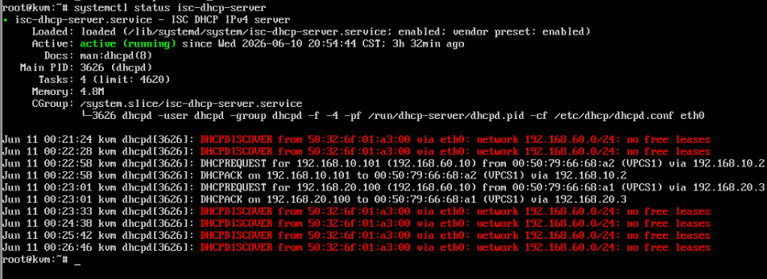

> *Screenshot: Output `systemctl status isc-dhcp-server` pada Ubuntu Server Jakarta. Terlihat service berstatus **active (running)** sejak 10 Juni 2026. Log DHCP menunjukkan aktivitas DHCPREQUEST dan DHCPACK untuk client VLAN 10 (192.168.10.101) dan VLAN 20 (192.168.20.100) yang berhasil mendapatkan IP.*

**IP Address Ubuntu Server (VLAN 60):**

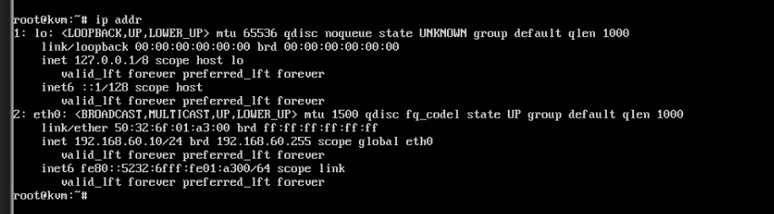

> *Screenshot: Output `ip addr` pada Ubuntu Server Jakarta. Terlihat interface eth0 dengan IP statis 192.168.60.10/24 dalam kondisi UP.*

**Status Nginx Web Server:**

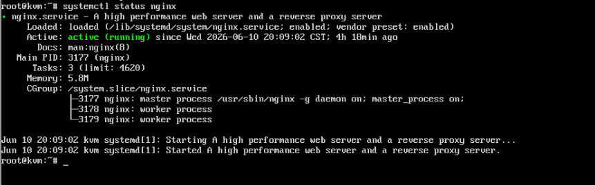

> *Screenshot: Output `systemctl status nginx` pada Ubuntu Server Jakarta. Terlihat Nginx berstatus **active (running)** sejak 10 Juni 2026 dengan Main PID 3177.*

---

### 3.3 FortiGate Jakarta

FortiGate Jakarta berfungsi sebagai edge firewall sisi HQ, NAT gateway ke internet, dan GRE endpoint menuju Surabaya. OSPF dijalankan di atas GRE Tunnel untuk mendistribusikan route jaringan Jakarta ke Surabaya secara dinamis.

**Interface Physical:**
```
Fortinet-Jakarta # get system interface physical
== [port1]
    mode: static  |  ip: 10.10.100.1 255.255.255.252  |  status: up
== [port2]
    mode: static  |  ip: 10.10.101.1 255.255.255.252  |  status: up
== [port3]
    mode: static  |  ip: 10.0.12.2 255.255.255.252    |  status: up
```

**Static Route:**
```
config router static
  edit 1   ← default route ke MikroTik ISP
    set gateway 10.0.12.1
    set device "port3"
  edit 2   ← route ke VLAN Jakarta via Cisco Router
    set dst 192.168.10.0 255.255.255.0
    set gateway 10.10.100.2
  edit 3   ← route ke VLAN Jakarta via MikroTik
    set dst 192.168.20.0 255.255.255.0
    set gateway 10.10.101.2
  edit 4   ← route ke VLAN 60 Server
    set dst 192.168.60.0 255.255.255.0
    set gateway 10.10.100.2
```

**GRE Tunnel:**
```
config system gre-tunnel
  edit "GRE-JKT-SBY"
    set interface "port3"
    set local-gw 10.0.12.2    ← IP WAN Jakarta
    set remote-gw 10.0.13.2   ← IP WAN Surabaya
```

**OSPF over GRE:**
```
config router ospf
  set router-id 2.2.2.2
  config area
    edit 0.0.0.0
  config network
    edit 1
      set prefix 172.16.0.1/32   ← advertise tunnel IP Jakarta
  config redistribute static
    set status enable             ← redistribusi semua static route ke OSPF
```

**Routing Table OSPF (route yang diterima dari Surabaya):**

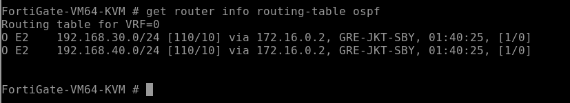

> *Screenshot: Output `get router info routing-table ospf` pada FortiGate Jakarta. Terlihat dua route OSPF External type 2 (O E2) yaitu 192.168.30.0/24 dan 192.168.40.0/24 yang dipelajari melalui GRE-JKT-SBY dengan next-hop 172.16.0.2. Hal ini membuktikan OSPF over GRE berhasil mendistribusikan route Surabaya ke Jakarta.*

---

### 3.4 FortiGate Surabaya

FortiGate Surabaya berfungsi sebagai edge firewall sisi Branch, NAT gateway ke internet, dan GRE endpoint menuju Jakarta. OSPF juga dijalankan di atas GRE untuk menerima route Jakarta dan mendistribusikan route Surabaya.

**Interface Physical:**
```
Fortinet-Surabaya # get system interface physical
== [port1]
    mode: static  |  ip: 10.0.13.2 255.255.255.252   |  status: up
== [port2]
    mode: static  |  ip: 10.10.200.1 255.255.255.252  |  status: up
```

**Routing Table Lengkap:**
```
Routing table for VRF=0
S*      0.0.0.0/0      [10/0] via 10.0.13.1, port1
C       10.0.13.0/30   is directly connected, port1
C       10.10.200.0/30 is directly connected, port2
C       172.16.0.1/32  is directly connected, GRE-SBY-JKT
C       172.16.0.2/32  is directly connected, GRE-SBY-JKT
O E2    192.168.10.0/24 [110/10] via 172.16.0.1, GRE-SBY-JKT  ← OSPF dari Jakarta
O E2    192.168.20.0/24 [110/10] via 172.16.0.1, GRE-SBY-JKT  ← OSPF dari Jakarta
S       192.168.30.0/24 [10/0] via 10.10.200.2, port2
S       192.168.40.0/24 [10/0] via 10.10.200.2, port2
O E2    192.168.60.0/24 [110/10] via 172.16.0.1, GRE-SBY-JKT  ← OSPF dari Jakarta
```

**Routing Table OSPF (route yang diterima dari Jakarta):**

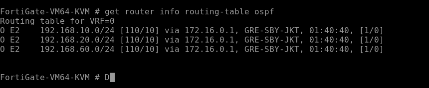

> *Screenshot: Output `get router info routing-table ospf` pada FortiGate Surabaya. Terlihat tiga route OSPF External type 2 (O E2) dari Jakarta: 192.168.10.0/24 (VLAN 10 Finance), 192.168.20.0/24 (VLAN 20 IT), dan 192.168.60.0/24 (VLAN Server), semuanya via 172.16.0.1 melalui GRE-SBY-JKT.*

---

### 3.5 MikroTik Router Surabaya

MikroTik Surabaya berfungsi sebagai gateway untuk VLAN 30 (Sales) dan VLAN 40 (Operations) di sisi Branch. DHCP Server lokal dijalankan untuk VLAN 30, sementara VLAN 40 menggunakan IP static.

**IP Address:**
```
[admin@mikrotik surabaya] > ip address print
 #   ADDRESS            NETWORK         INTERFACE
 0   10.10.200.2/30     10.10.200.0     ether1             ← ke FortiGate Surabaya
 1   192.168.30.1/24    192.168.30.0    vlan30-sales       ← gateway VLAN 30
 2   192.168.40.1/24    192.168.40.0    vlan40-operations  ← gateway VLAN 40
```

**DHCP Server VLAN 30:**
```
/ip dhcp-server print
 #    NAME    INTERFACE    ADDRESS-POOL   LEASE-TIME
 0    dhcp1   vlan30-sales dhcp_pool0     10m

/ip pool print
 # NAME        RANGES
 0 dhcp_pool0  192.168.30.2-192.168.30.254
```

**Routing Table:**
```
[admin@mikrotik surabaya] > ip route print
 #      DST-ADDRESS        PREF-SRC        GATEWAY            DISTANCE
 0 A S  0.0.0.0/0                          10.10.200.1               1  ← default ke FortiGate
 1 ADC  10.10.200.0/30     10.10.200.2     ether1                    0
 2 ADC  192.168.30.0/24    192.168.30.1    vlan30-sales              0
 3 ADC  192.168.40.0/24    192.168.40.1    vlan40-operations         0
```

---

## 4. Hasil Pengujian

### 4.1 DHCP Client Jakarta (VLAN 10 & 20)

Client pada VLAN 10 dan VLAN 20 mendapatkan IP dari Ubuntu Server Jakarta (192.168.60.10) melalui DHCP Relay yang dikonfigurasi di Cisco Router Jakarta dan MikroTik Router Jakarta.

**VLAN 10 — Finance (DHCP dari Ubuntu Server):**

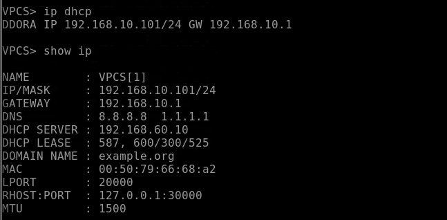

> *Screenshot: VPCS client VLAN 10 menjalankan `ip dhcp` dan berhasil mendapatkan IP **192.168.10.101/24** dengan gateway 192.168.10.1 (VRRP Virtual IP) dari DHCP Server 192.168.60.10 (Ubuntu Server Jakarta). DNS 8.8.8.8 dan 1.1.1.1 juga diberikan sesuai konfigurasi dhcpd.conf.*

**VLAN 20 — IT (DHCP dari Ubuntu Server):**

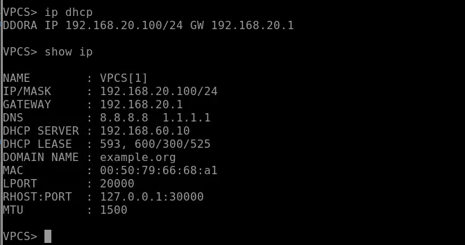

> *Screenshot: VPCS client VLAN 20 menjalankan `ip dhcp` dan berhasil mendapatkan IP **192.168.20.100/24** dengan gateway 192.168.20.1 (VRRP Virtual IP) dari DHCP Server 192.168.60.10 (Ubuntu Server Jakarta). Hal ini membuktikan DHCP Relay dari MikroTik Jakarta ke Ubuntu Server berjalan dengan benar.*

---

### 4.2 DHCP Client Surabaya (VLAN 30) & Static VLAN 40

**VLAN 30 — Sales (DHCP dari MikroTik Surabaya):**

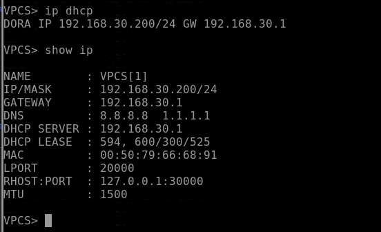

> *Screenshot: VPCS client VLAN 30 mendapatkan IP **192.168.30.200/24** dengan gateway 192.168.30.1 dari DHCP Server lokal MikroTik Surabaya (192.168.30.1). Berbeda dengan sisi Jakarta yang menggunakan DHCP Server terpusat, sisi Surabaya menggunakan DHCP Server langsung di MikroTik.*

**VLAN 40 — Operations (IP Static):**

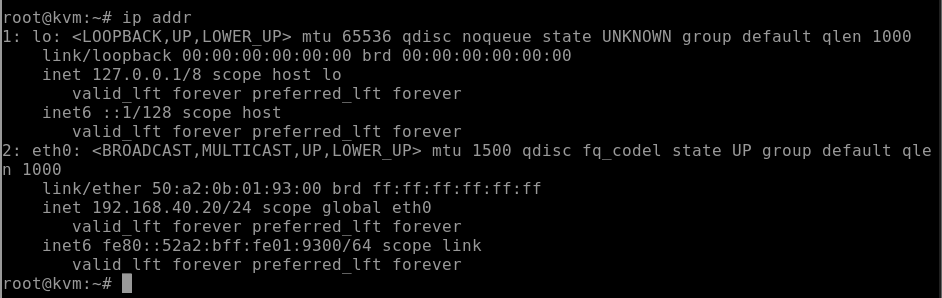

> *Screenshot: VPCS client VLAN 40 menampilkan `show ip` dengan IP statis **192.168.40.10/24** dan gateway 192.168.40.1. IP dikonfigurasi secara manual tanpa DHCP sesuai ketentuan topology.*

**VLAN 40 — Operations (IP Static — Linux Client):**

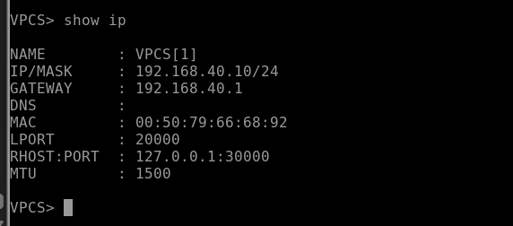

> *Screenshot: Linux client di VLAN 40 menampilkan output `ip addr` dengan IP statis **192.168.40.20/24** pada interface eth0. Ini merupakan client kedua di VLAN 40 yang juga dikonfigurasi static.*

---

### 4.3 Akses Internet dari Jakarta dan Surabaya

**Ping 8.8.8.8 dari FortiGate Jakarta:**

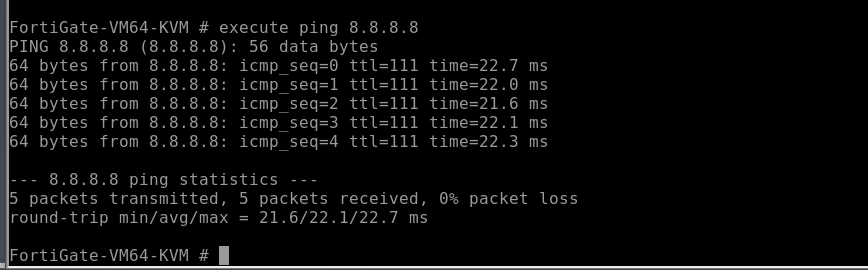

> *Screenshot: FortiGate Jakarta menjalankan `execute ping 8.8.8.8` dan mendapatkan balasan 64 bytes dari 8.8.8.8 dengan TTL 111 dan rata-rata RTT 22.1 ms. Hal ini membuktikan NAT masquerade pada MikroTik ISP dan koneksi internet dari sisi HQ Jakarta berjalan dengan benar.*

**Ping 8.8.8.8 dari FortiGate Surabaya:**

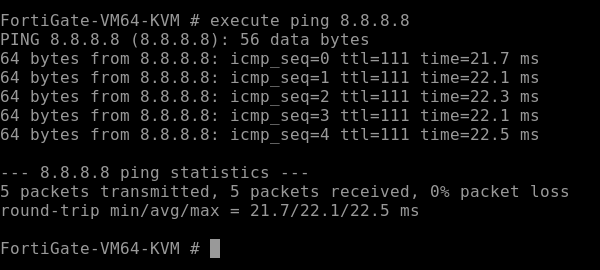

> *Screenshot: FortiGate Surabaya menjalankan `execute ping 8.8.8.8` dan mendapatkan balasan konsisten dari 8.8.8.8 dengan RTT rata-rata 22.1 ms. Hal ini membuktikan jalur internet dari Branch Surabaya melalui MikroTik ISP berjalan dengan benar.*

---

### 4.4 GRE Tunnel antar-FortiGate

GRE Tunnel menghubungkan FortiGate Jakarta (172.16.0.1) dan FortiGate Surabaya (172.16.0.2) melalui jalur WAN ISP. Tunnel ini menjadi transport layer bagi OSPF untuk bertukar informasi routing antar-site.

**Ping Tunnel dari FortiGate Jakarta ke Surabaya (172.16.0.2):**

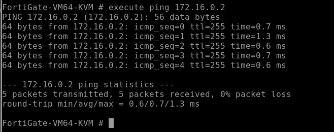

> *Screenshot: FortiGate Jakarta menjalankan `execute ping 172.16.0.2` dan mendapatkan 5 reply dari IP tunnel Surabaya dengan RTT rata-rata 0.7 ms dan 0% packet loss. Hal ini membuktikan GRE Tunnel dari Jakarta ke Surabaya aktif dan dapat dilewati traffic.*

**Ping Tunnel dari FortiGate Surabaya ke Jakarta (172.16.0.1):**

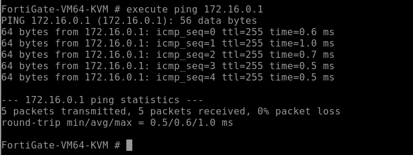

> *Screenshot: FortiGate Surabaya menjalankan `execute ping 172.16.0.1` dan mendapatkan 5 reply dari IP tunnel Jakarta dengan RTT rata-rata 0.6 ms dan 0% packet loss. Tunnel bersifat bidireksional dan aktif dari kedua sisi.*

---

### 4.5 OSPF over GRE

OSPF dijalankan di atas GRE Tunnel untuk mendistribusikan route jaringan Jakarta dan Surabaya secara dinamis. Static route di masing-masing FortiGate di-redistribute ke OSPF sehingga semua VLAN dapat dikenal oleh kedua sisi.

**OSPF Neighbor dari FortiGate Jakarta (melihat Surabaya):**

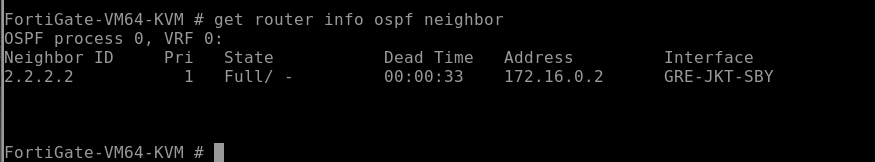

> *Screenshot: Output `get router info ospf neighbor` pada FortiGate Jakarta. Terlihat neighbor **2.2.2.2** (Neighbor ID FortiGate Surabaya) dengan state **Full/-** via interface GRE-JKT-SBY dan address 172.16.0.2. State Full menandakan adjacency OSPF berhasil terbentuk sempurna.*

**OSPF Neighbor dari FortiGate Surabaya (melihat Jakarta):**

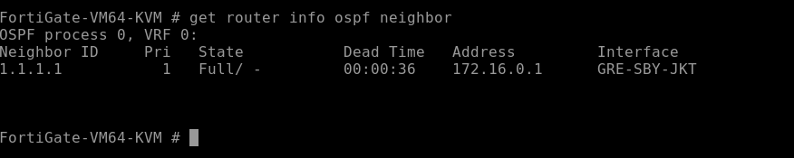

> *Screenshot: Output `get router info ospf neighbor` pada FortiGate Surabaya. Terlihat neighbor **1.1.1.1** (Neighbor ID FortiGate Jakarta) dengan state **Full/-** via interface GRE-SBY-JKT dan address 172.16.0.1. Kedua FortiGate saling mengenal satu sama lain sebagai OSPF neighbor dengan state Full.*

| FortiGate      | Neighbor ID | State  | Interface   | Address    |
|----------------|-------------|--------|-------------|------------|
| Jakarta        | 2.2.2.2     | Full/- | GRE-JKT-SBY | 172.16.0.2 |
| Surabaya       | 1.1.1.1     | Full/- | GRE-SBY-JKT | 172.16.0.1 |

---

### 4.6 Ping antar-Site Jakarta–Surabaya

Setelah GRE Tunnel aktif dan OSPF berhasil mendistribusikan route, pengujian konektivitas end-to-end dilakukan dari client Jakarta menuju client Surabaya.

**Ping dari Client Jakarta ke Client Surabaya:**

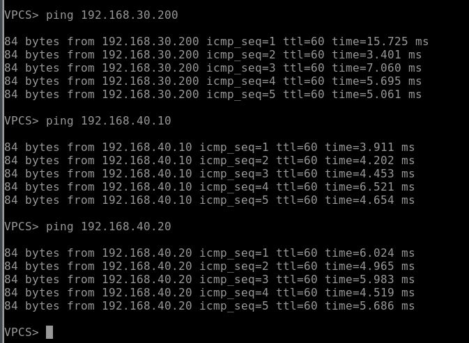

> *Screenshot: VPCS client Jakarta melakukan ping ke 192.168.30.200 (client VLAN 30 Surabaya), 192.168.40.10, dan 192.168.40.20 (client VLAN 40 Surabaya). Ketiga target mendapatkan reply dengan TTL 60 dan RTT antara 3–16 ms, membuktikan jalur GRE Tunnel → OSPF → MikroTik Surabaya berhasil meneruskan traffic lintas-site.*

> *Screenshot ping dari client Surabaya ke Jakarta belum tersedia — akan dilengkapi.*

| Sumber           | Tujuan                    | Hasil      | TTL | Keterangan                      |
|------------------|---------------------------|------------|-----|---------------------------------|
| Client JKT (VLAN 10) | 192.168.30.200 (SBY VLAN30) | ✅ Reply | 60  | Via GRE Tunnel + OSPF           |
| Client JKT (VLAN 10) | 192.168.40.10 (SBY VLAN40)  | ✅ Reply | 60  | Via GRE Tunnel + OSPF           |
| Client JKT (VLAN 10) | 192.168.40.20 (SBY VLAN40)  | ✅ Reply | 60  | Via GRE Tunnel + OSPF           |

---

### 4.7 Akses Web Server Jakarta dari Surabaya

Web server Nginx di Ubuntu Server Jakarta (192.168.60.10) dapat diakses dari sisi Surabaya melalui jalur GRE Tunnel, membuktikan konektivitas lintas-site yang lengkap.

**Curl Web Server Jakarta dari Surabaya:**

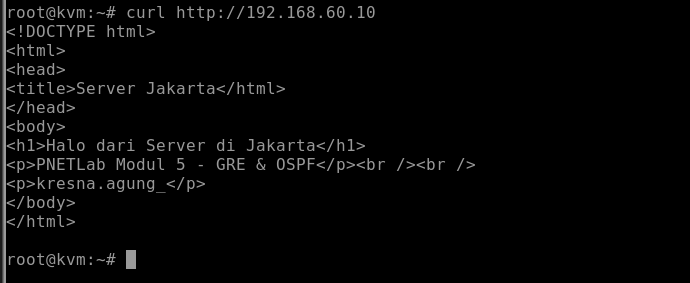

> *Screenshot: Client Surabaya menjalankan `curl http://192.168.60.10` dan mendapatkan response HTML dari web server Nginx Jakarta. Halaman menampilkan identitas server: "Halo dari Server di Jakarta" dengan label "PNETLab Modul 5 - GRE & OSPF" dan nama kresna.agung\_. Hal ini membuktikan jalur traffic Surabaya → FortiGate Surabaya → GRE Tunnel → FortiGate Jakarta → MikroTik/Cisco Jakarta → Ubuntu Server berjalan end-to-end dengan benar.*

---

## 5. Analisis

### Arsitektur Dual Gateway dengan VRRP

Sisi Jakarta mengimplementasikan dual gateway menggunakan Cisco Router dan MikroTik Router dengan protokol VRRP. Cisco Router menjadi master untuk VLAN 10 dan VLAN 60 (prioritas lebih tinggi), sedangkan MikroTik Router menjadi master untuk VLAN 20. Virtual IP masing-masing VLAN (192.168.10.1, 192.168.20.1, 192.168.60.1) diberikan ke client sebagai default gateway, sehingga jika salah satu router mengalami gangguan, router lainnya akan otomatis mengambil alih tanpa perubahan konfigurasi di sisi client.

### DHCP Terpusat vs Lokal

Topologi ini menerapkan dua strategi DHCP yang berbeda. Di sisi Jakarta, ISC-DHCP Server terpusat di Ubuntu Server digunakan agar pool DHCP untuk VLAN 10 dan VLAN 20 dikelola dari satu titik, mempermudah administrasi. DHCP Relay di Cisco Router dan MikroTik meneruskan request dari client ke Ubuntu Server di VLAN 60. Di sisi Surabaya, DHCP Server dijalankan langsung di MikroTik Surabaya untuk VLAN 30 karena tidak ada kebutuhan pengelolaan terpusat.

### GRE Tunnel sebagai Transport OSPF

GRE Tunnel memberikan jalur virtual point-to-point antara dua FortiGate meskipun keduanya terhubung melalui jaringan ISP yang tidak mengerti routing internal enterprise. Dengan menjalankan OSPF di atas tunnel ini, setiap perubahan route di satu sisi (misalnya penambahan VLAN baru) akan otomatis diketahui oleh sisi lainnya tanpa perlu mengubah static route secara manual.

### Redistribute Static ke OSPF

Karena VLAN di belakang FortiGate dikonfigurasi sebagai static route (bukan interface OSPF langsung), diperlukan redistribusi static route ke OSPF agar route tersebut dapat diiklankan ke neighbor. Hasilnya terlihat pada routing table sebagai route bertipe O E2 (OSPF External type 2), yang berarti route diterima dari redistribusi, bukan dari OSPF intra-area.

### Verifikasi Hasil Pengujian

| Skenario                                    | Ekspektasi  | Hasil Aktual | Status      |
|---------------------------------------------|-------------|--------------|-------------|
| VLAN 10 Jakarta dapat DHCP dari Ubuntu      | IP dari pool 192.168.10.x | 192.168.10.101 | ✅ Sesuai |
| VLAN 20 Jakarta dapat DHCP dari Ubuntu      | IP dari pool 192.168.20.x | 192.168.20.100 | ✅ Sesuai |
| VLAN 30 Surabaya dapat DHCP dari MikroTik   | IP dari pool 192.168.30.x | 192.168.30.200 | ✅ Sesuai |
| VLAN 40 Surabaya menggunakan IP static      | 192.168.40.10 / .20 | Sesuai   | ✅ Sesuai |
| FortiGate Jakarta ping internet (8.8.8.8)   | Reply       | Reply        | ✅ Sesuai |
| FortiGate Surabaya ping internet (8.8.8.8)  | Reply       | Reply        | ✅ Sesuai |
| GRE Tunnel Jakarta → Surabaya aktif         | Ping 172.16.0.2 reply | Reply  | ✅ Sesuai |
| GRE Tunnel Surabaya → Jakarta aktif         | Ping 172.16.0.1 reply | Reply  | ✅ Sesuai |
| OSPF neighbor Jakarta ↔ Surabaya Full       | State Full  | Full/-       | ✅ Sesuai |
| Route Surabaya muncul di Jakarta (OSPF)     | O E2 192.168.30/40 | Terlihat | ✅ Sesuai |
| Route Jakarta muncul di Surabaya (OSPF)     | O E2 192.168.10/20/60 | Terlihat | ✅ Sesuai |
| Ping antar-site Jakarta ke Surabaya         | Reply TTL 60 | Reply      | ✅ Sesuai |
| Akses web server Jakarta dari Surabaya      | HTML response | HTML diterima | ✅ Sesuai |
| Ping antar-site Surabaya ke Jakarta         | Reply       | Belum diverifikasi | ⏳ Pending |

---

## 6. Kesimpulan

Seluruh komponen utama dalam tugas modul Enterprise HQ–Branch berhasil dikonfigurasi dan diverifikasi melalui pengujian end-to-end. Beberapa poin penting yang dapat disimpulkan:

1. **VRRP dual gateway** berhasil diimplementasikan antara Cisco Router dan MikroTik Router di sisi Jakarta, memberikan redundansi gateway untuk VLAN 10, 20, dan 60 tanpa perubahan konfigurasi di sisi client.

2. **ISC-DHCP Server terpusat** di Ubuntu Server Jakarta berhasil melayani request DHCP dari dua VLAN berbeda (VLAN 10 dan VLAN 20) melalui mekanisme DHCP Relay di Cisco Router dan MikroTik Router, membuktikan bahwa DHCP Relay dapat bekerja lintas-router.

3. **GRE Tunnel** berhasil menghubungkan FortiGate Jakarta dan FortiGate Surabaya secara transparan melalui jaringan ISP, membuktikan bahwa koneksi antar-site enterprise dapat dibangun di atas infrastruktur public network.

4. **OSPF over GRE** dengan redistribute static berhasil membentuk neighbor state Full antara kedua FortiGate, sehingga route VLAN Jakarta dapat dikenal oleh Surabaya dan sebaliknya secara dinamis tanpa konfigurasi static route manual antar-site.

5. **Konektivitas end-to-end** antara client Jakarta dan client Surabaya, termasuk akses ke web server Nginx, berhasil dibuktikan melalui pengujian ping dan curl, mengkonfirmasi bahwa seluruh jalur traffic (VLAN → Router → FortiGate → GRE Tunnel → FortiGate → Router → VLAN) berfungsi sesuai rancangan topologi.

6. Penggunaan **platform PNETLab** memungkinkan simulasi topologi enterprise kompleks multi-vendor (Cisco, MikroTik, FortiGate, Ubuntu) dalam satu lingkungan terpadu, mendekati skenario nyata implementasi jaringan enterprise.
